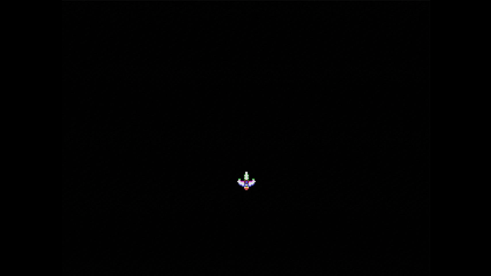
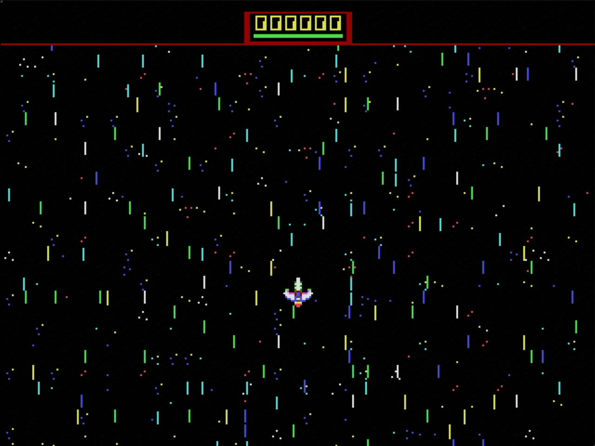
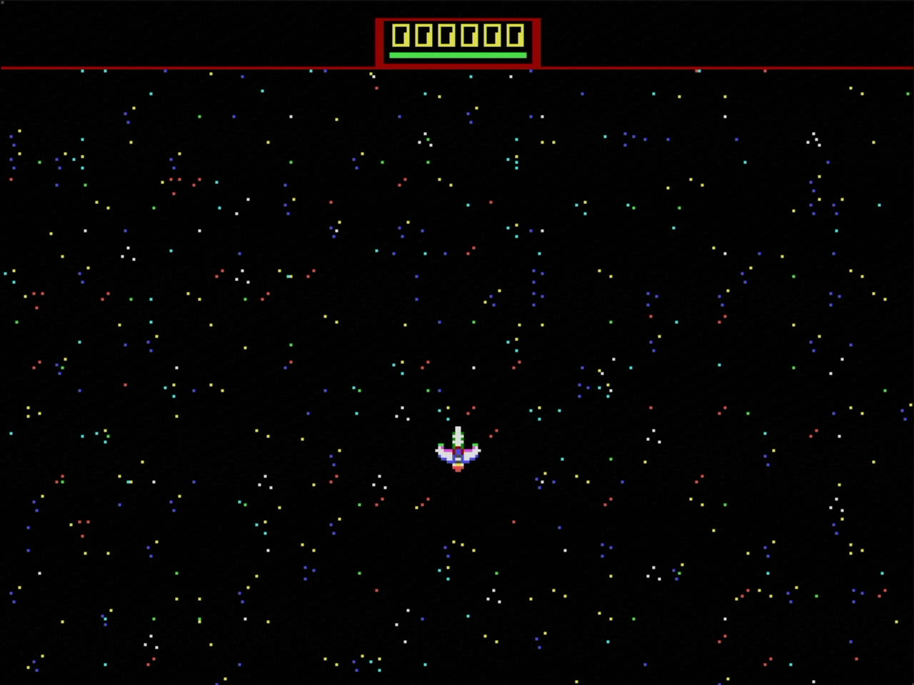
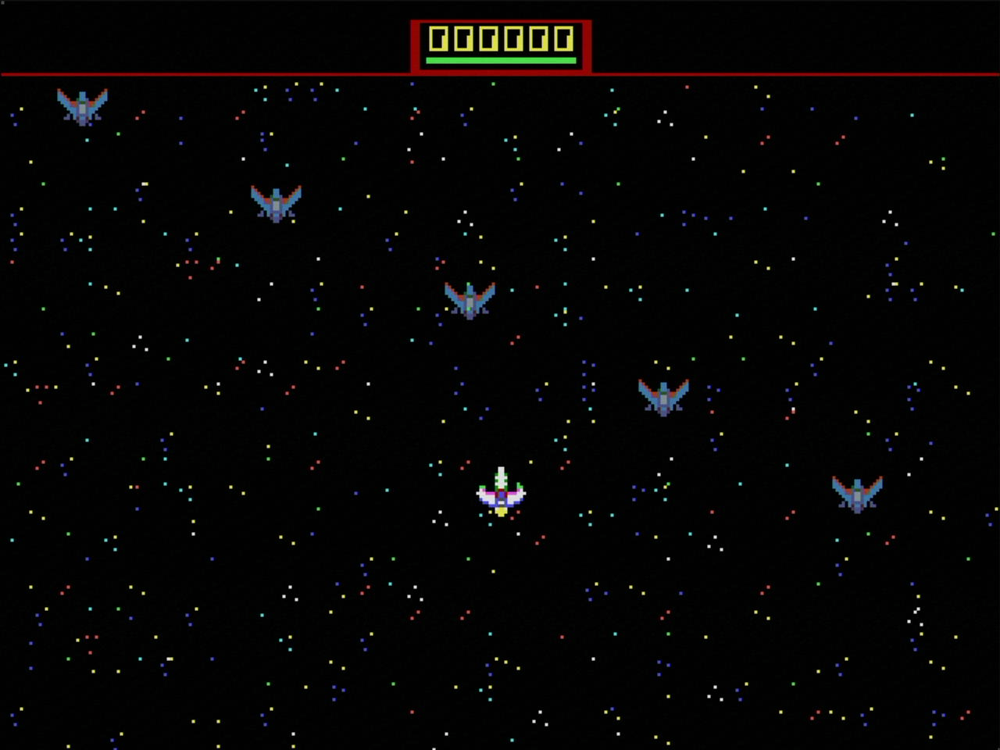

# RP6502 Game Demo for LLVM-MOS


## Star Hopper — How to Play

Star Hopper is a vertical shoot-em-up for the Picocomputer (RP6502). Fight through 7 levels of enemy waves, defeat a boss at the end of each level, and survive to reach the YOU WIN screen.

### Controls

| Action | Gamepad |
|---|---|
| Move | D-Pad or Left Stick |
| Fire | X |
| Pause | Start |

### Enemies and Scoring

There are 7 enemy types, each worth more points than the last (10, 15, 20 … ). Destroying enemies without taking damage builds your **score multiplier** (1× up to 5×). Taking a hit resets the multiplier to 1×. 

After clearing a level, a **bonus screen** tallies your kills per enemy type and awards bonus points scaled by the level number.

### Boss Fights

Each level ends with a boss encounter.  Bosses have a vulerable that is bright yellow.  Shoot it to deal damage.  Some bosses will only be vunerable after certain conditions are met, which will be telegraphed visually.  For example, Boss Variant Four (Level 4) requires you to destroy all but one of the smaller enemies on screen before its vulnerable point will appear.

You have **4 minutes** to defeat the boss. If time runs out, the boss retreats and the level is marked **LEVEL FAILED**. Press Start to retry the same level.

### Asteroids and Power-Ups

Destroying asteroids can reveal power-up capsules. Pickups follow a fixed repeating sequence across the whole run:

| Icon | Pick-Up | Effect |
|---|---|---|
| **P** | Power | Increases fire rate (faster shots, down to a minimum cooldown) |
| **E** | Energy | Restores 8 HP |
| **S** | Speed | Raises your maximum movement speed |


### Health

Your ship has 48 HP. The health bar at the top right turns red when HP drops below 12. You have a brief invincibility window after each hit. Reaching 0 HP triggers a game-over.

---

## Table of Contents
- [Introduction](#introduction)
- [Platform Concepts](#platform-concepts)
- [Getting Started](#getting-started)
- [Provided Image Assets](#provided-image-assets)
- [Setting up Graphics](#setting-up-graphics)
- [Adding a Sprite](#adding-a-sprite)
- [Converting PNG Assets](#converting-png-assets)
- [Creating Graphics in Aseprite](#creating-graphics-in-aseprite)
- [Input System](#input-system)
- [Tilemaps and Backgrounds](#tilemaps-and-backgrounds)
- [Music](#music)
- [Making Music in Furnace (OPL2/YM3812 -> VGM)](#making-music-in-furnace-opl2ym3812---vgm)
- [Animations and Palette Swapping](#animations-and-palette-swapping)
- [Adding Bullets](#adding-bullets)
- [Gameplay Loop](#gameplay-loop)
- [Enemies and Collision Detection](#enemies-and-collision-detection)

## Introduction

This is a complete shoot-em-up (**Star Hopper**) built for the Picocomputer (RP6502) using the LLVM-MOS C toolchain. The game was written incrementally, and this README follows the same steps — you can read the code and explanations side by side and build your own game the same way.

The Picocomputer is built around a real WDC 65C02 CPU. Programming it feels like classic 8-bit development, but the surrounding hardware — VGA, OPL2 audio, gamepads, WiFi — is all modern and fully open source. Before jumping into code, it helps to understand a few concepts that are unique to this platform.

## Platform Concepts

Understanding these ideas first will make every later section much easier to follow.

### System RAM and XRAM

The 6502 sees its normal 64 KB of system RAM (`0x0000–0xFFFF`). This is where program code, the stack, and variables live. The RP6502 also has a second 64 KB called **Extended RAM (XRAM)**. XRAM is *not* directly addressable by the 6502 — there is no `LDA` or `STA` for it. Instead, the RIA chip provides two portals — `ADDR0/RW0` and `ADDR1/RW1` at hardware registers `0xFFE4–0xFFEB` — that let you read and write XRAM one byte at a time with auto-incrementing addresses. The LLVM-MOS SDK wraps this in convenient macros:

```c
xram0_struct_set(ptr, vga_mode5_sprite_t, x_pos_px, 120); // write one struct field into XRAM
```

### XRAM is the VGA System's Memory

The most important concept: **the VGA module reads XRAM directly and continuously.** You do not call a "draw sprite at X, Y" function each frame. Instead, you write a sprite's configuration (position, frame pointer, palette pointer) into a small struct in XRAM once, and the VGA hardware renders it automatically on every frame — until you change it.

To move a sprite, you write two new 16-bit values into XRAM. There is no draw call. This is what makes smooth 60 FPS animation possible even on a slow 6502.

### Three Planes, Fill + Sprite Layers

The VGA system has three numbered planes (0, 1, 2). Each plane has two independent layers:
- A **fill layer** — a tile map, bitmap, or console that covers the plane background.
- A **sprite layer** — a pool of hardware sprites drawn over the fill.

Different scanline ranges of the same plane can use different modes. This is how the HUD occupies just the top 24 scanlines of plane 2, while the gameplay tiles use the remaining scanlines.

This demo's plane layout:

| Plane | Fill layer | Sprite layer |
|---|---|---|
| 0 | Background star tiles (scanlines 24–239) |  Projectile sprites (full screen) |
| 1 | Foreground star tiles (scanlines 24–239) | Enemy sprites (scanlines 24–239) |
| 2 | HUD tile map (scanlines 0–23) | Player |

### Canvas and Vsync

`xreg_vga_canvas(1)` selects a canvas resolution. This demo uses canvas `1` (320×240, 4:3). Available options:
- `0` — 80-column console
- `1` — 320×240 (4:3)
- `2` — 320×180 (16:9)
- `3` — 640×480 (4:3)
- `4` — 640×360 (16:9)

The register `RIA.vsync` at address `0xFFE3` increments once per frame (~60 Hz) when a VGA module is connected. Your game loop compares it against a saved value to know when a new frame has started:

```c
if (RIA.vsync == vsync_last) continue; // same frame — spin
vsync_last = RIA.vsync;               // new frame — run game logic
```

### ROM Assets and the XRAM Address Offset

In `CMakeLists.txt`, XRAM assets are given load addresses starting at `0x10000`:

```cmake
rp6502_asset(RPStarHopper 0x10000 images/Player_4bpp.bin)
```

Within your C code, XRAM is addressed `0x0000–0xFFFF`. The `0x10000` prefix in CMake is a ROM packaging convention: the ROM loader uses addresses `0x10000–0x1FFFF` to mean "load this into XRAM". Your `ADDR0` portal and all XRAM struct pointers always use plain 16-bit XRAM addresses. This is why `constants.h` defines `PLAYER_DATA = 0x0000` even though CMakeLists.txt says `0x10000`.

### Configuring Video Modes with XREG

`xreg_vga_mode(mode, options, config_addr, ...)` installs a video mode for a range of scanlines. It tells the VGA: "use mode X, reading configuration from XRAM address Y, on plane Z, for scanlines BEGIN through END." This is only called once at startup — not every frame.

The `options` byte is a compact bitfield. For **Mode 5** (paletted sprites):
- **bits\[5:3\]** — sprite size: `000`=8×8, `001`=16×16, `010`=32×32 …
- **bits\[2:0\]** — color depth: `000`=1bpp, `001`=2bpp, `010`=4bpp, `011`=8bpp

So `0x0A` (`0b00001010`) means **16×16 sprites, 4bpp**, and `0x02` (`0b00000010`) means **8×8 sprites, 4bpp**.

For **Mode 2** (tile maps):
- **bit\[3\]** — tile size: `0`=8×8, `1`=16×16
- **bits\[2:0\]** — color depth (same table as above)

So `0x02` means **8×8 tiles, 4bpp**. See the [VGA documentation](https://picocomputer.github.io/vga.html) for the full reference.

## Getting Started

Tool prerequisites for this repo:

- LLVM-MOS RP6502 toolchain in VS Code (`vscode-llvm-mos` template setup)
- Python 3
- Pillow for image conversion scripts

Install Python dependency:

```bash
python3 -m pip install pillow
```

Get started by using the vscode-llvm-mos template from https://github.com/picocomputer/vscode-llvm-mos.  Find the "Use this template" button and follow the instructions to create a new repository.  

Once you have your repository set up, we are going to update CMakeLists.txt to build the demo game.  Update the contents of CMakeLists.txt to have the name of the game you want to make.  In this example, we are going to make a game called RPStarHopper.  The CMakeLists.txt file should look something like this:

```cmake
cmake_minimum_required(VERSION 3.18)

add_subdirectory(tools)

set(LLVM_MOS_PLATFORM rp6502)
find_package(llvm-mos-sdk REQUIRED)

project(RPStarHopper C CXX ASM)

add_executable(RPStarHopper)

rp6502_asset(RPStarHopper help src/help.txt)

rp6502_executable(RPStarHopper 
    DATA file 
    RESET file
)

target_sources(RPStarHopper PRIVATE
    src/main.c
)
```

At this point, you should be able to build the project in VS Code with the build button and run it on your Picocomputer via F5 or the run button.  You can also run it from the command line with one of the following:
```
python3 ./tools/rp6502.py run build/RPStarHopper.rp6502
python3 ./tools/rp6502_mac.py run build/RPStarHopper.rp6502
```

## Provided Image Assets

Before we start graphics setup, here is what is already provided in `images/` and how each file is used.

### Runtime assets used by the game

| File | Size | Purpose |
|---|---:|---|
| `Player_4bpp.bin` | 768 bytes | Player sprite sheet (6 frames, 16x16, 4bpp). |
| `Projectiles_4bpp.bin` | 416 bytes | Projectiles, pickups, asteroids, and explosion frames (13 frames, 8x8, 4bpp). |
| `Enemies_4bpp.bin` | 22528 bytes | Enemy + boss sprite sheet (176 frames, 16x16, 4bpp). |
| `StarFields_tiles_4bpp.bin` | 8096 bytes | Shared tile pixel data for BG/FG/HUD; 8x8 tiles at 4bpp (currently 253 tiles present, 256 max supported). |
| `StarFields_BG_map.bin` | 2400 bytes | Background tilemap index grid (40x60, 1 byte per tile). |
| `StarFields_FG_map.bin` | 2400 bytes | Foreground tilemap index grid (40x60, 1 byte per tile). |
| `StarFields_HUD_map.bin` | 1200 bytes | HUD tilemap index grid (40x30, 1 byte per tile). |
| `StarFields_HUD_map1.bin` | 1200 bytes | ROM-named HUD map variant used for restoring HUD tiles from ROM when needed. |

### Palette helper files

These are generated helper artifacts from conversion scripts. They are useful for editing and code generation, but the game primarily consumes the `.bin` image/map assets above.

| File pattern | Purpose |
|---|---|
| `*_4bpp_palette.bin` | Raw 16-color palette data (32 bytes) for a converted asset. |
| `*_4bpp_palette.h` | C header with palette constants for compile-time use. |

Asset naming convention in this project:
- `*_4bpp.bin` = pixel data (tile/sprite frames)
- `*_map.bin` = tile index map data
- `*_palette.*` = palette helper output

### XRAM placement summary

These are the current XRAM load addresses from `rp6502_asset(...)` in `CMakeLists.txt`.

| File | CMake load address | Notes |
|---|---:|---|
| `images/Player_4bpp.bin` | `0x10000` | Player sprite frames |
| `images/StarFields_BG_map.bin` | `0x10300` | BG tile index map |
| `images/StarFields_FG_map.bin` | `0x10C60` | FG tile index map |
| `images/StarFields_HUD_map.bin` | `0x115C0` | HUD tile index map |
| `images/StarFields_tiles_4bpp.bin` | `0x11A70` | Shared tile pixels |
| `images/Projectiles_4bpp.bin` | `0x13A70` | Projectile/pickup/asteroid/explosion frames |
| `images/Enemies_4bpp.bin` | `0x13C10` | Enemy + boss frames |

Reminder: in C code you access these through 16-bit XRAM pointers (for example `PLAYER_DATA = 0x0000`) because the `0x10000` prefix is the ROM-packaging address space used by the loader.

## Setting up Graphics

The documentation for the Picocomputer is excellent:
https://picocomputer.github.io

For this demo we are going to work with a 320x240 canvas.   Let's start by initializing the graphics system.  We can do this by calling the xreg_vga_canvas function with a parameter of 1.  Add the following to your main.c file, as well as ```#include <stdbool.h>``` at the top of the file:


```c
static bool init_graphics(void)
{
    // 320×240 canvas
    int rc;
    rc = xreg_vga_canvas(1);
    if (rc < 0) {
        puts("Error: xreg_vga_canvas(1) failed");
        return false;
    }
    return true;
}
```

The key line here is ```xreg_vga_canvas(1);``` which initializes the VGA system and sets up a canvas with a resolution of 320x240 pixels.  If the function returns a negative value, it means that there was an error initializing the graphics system, so we print an error message and return false.  If the initialization is successful, we return true.  We can now call this function from our main, and also set up a vsync loop to keep the program running.  Update your main function to look like this:

```c

uint8_t vsync_last = 0;

int main(void)
{
    if (!init_graphics()) {
        puts("Fatal: graphics initialization failed");
        return 1;
    }

    // Main loop
    while (true) {
        // 1. SYNC
        if (RIA.vsync == vsync_last) continue;
        vsync_last = RIA.vsync;
    }

    return 0;
}
```

We have added ```vsync_last``` to keep track of the last vsync state.  In our main loop, we check if the current vsync state is the same as the last one, and if it is, we continue to the next iteration of the loop.  This effectively creates a loop that runs once per frame, synced to the vertical refresh of the display.  This is important for ensuring smooth graphics and avoiding screen tearing.

If you build and run this code, you should see a blank screen on your Picocomputer.  This means that we have successfully initialized the graphics system and are running a main loop that is synced to the vertical refresh of the display.  In the next section, we will start drawing some pixels to the screen!  To exit the program hit ```ALT + F4``` on the keyboard connected to your Picocomputer.

## Adding a Sprite

We are going to use Mode 5 Sprite system for the demo.  It's very flexible and powerful.  We are going to add a 4-bpp (16-color) sprite with a custom palette and start to get a feel for the XRAM system.   The images folder contains ```Player_4bpp.bin``` which is a 16x16 pixel tile-based Sprite in the 4-bpp format.  We will learn later how to make our own sprites and convert them to the correct format.  

We are going to load this sprite into XRAM and then draw it to the screen.  First, we need to add the sprite as an asset in our CMakeLists.txt file.  Update your CMakeLists.txt to add a new rp6502_asset for the sprite, and make sure to include the correct path to the image file.  Your CMakeLists.txt should now look like this:

```cmake
cmake_minimum_required(VERSION 3.18)

add_subdirectory(tools)

set(LLVM_MOS_PLATFORM rp6502)
find_package(llvm-mos-sdk REQUIRED)

project(RPStarHopper C CXX ASM)

add_executable(RPStarHopper)

rp6502_asset(RPStarHopper 0x10000 images/Player_4bpp.bin)
rp6502_asset(RPStarHopper help src/help.txt)

rp6502_executable(RPStarHopper 
    DATA file 
    RESET file
)

target_sources(RPStarHopper PRIVATE
    src/main.c
)
```

This will place the sprite in XRAM at address 0x10000.  I strongly recommend using a simple spreadsheet to track XRAM memory usage.  You can use my template if you like:
https://docs.google.com/spreadsheets/d/1FLckfGkOWBRM4_hf3JohAPjYF4lZ37s38hei422bUt4/edit?usp=sharing

I personally like to track assets using a ```constants.h``` file.  

```c
#ifndef CONSTANTS_H
#define CONSTANTS_H

// Screen dimensions
#define SCREEN_WIDTH 320
#define SCREEN_HEIGHT 240

// Sprite data configuration
#define SPRITE_DATA_START       0x0000U            // Starting address in XRAM for sprite data

#define PLAYER_DATA            (SPRITE_DATA_START) // Address for main tile bitmap data
#define PLAYER_DATA_SIZE        0x0300U            // 768 bytes (6 frames 16x16 at 4bpp)
#define PLAYER_SPRITE_SIZE_PX   16                 // Player sprite is 16x16 pixels

#define SPRITE_DATA_END        (PLAYER_DATA + PLAYER_DATA_SIZE) // End address for sprite data

// Palette configurations
#define PLAYER_PALETTE_ADDR    0xFC00  // 16-color palette (32 bytes, 0xFC00-0xFC1F)
#define PLAYER_PALETTE_SIZE    0x0020

#endif // CONSTANTS_H
```

This file defines some constants for our game, including the screen dimensions and the memory layout for our sprite data.  We have defined a section of XRAM starting at 0x0000 for our sprite data, and we have allocated 768 bytes for the player sprite sheet, which is six 16x16 frames at 4 bits per pixel (4bpp).  Each 16x16 frame requires 128 bytes (16 * 16 * 4 bits / 8 bits per byte = 128 bytes), and 6 frames total 768 bytes.  If you use the Spreadsheet all the Hex math is done for you.  

We have also defined XRAM space for the player's palette, which is 32 bytes (16 colors * 2 bytes per color = 32 bytes).  The palette will be stored at address 0xFC00.  We will load our custom palette data into this location in XRAM and then point the VGA system to it when we set up our sprite.  Notice that in CMakeLists.txt we have placed the sprite at 0x10000, but in our constants.h we have defined the sprite data to start at 0x0000. The offset is handled by rp6502.h XRAM calls.

Now let's create ```sprite_mode5.c``` and ````sprite_mode5.h```` files to handle the sprite drawing logic.  In these files, we will write functions to initialize the sprite system, load our sprite data into XRAM, and draw the sprite to the screen.  This will help us keep our main.c file clean and organized.  Here is an example of what the contents of these files might look like.  Here is the code for ```sprite_mode5.c```:

```c
#include <rp6502.h>
#include <stdio.h>
#include <stdint.h>
#include "constants.h"
#include "sprite_mode5.h"

// Store the player config address for updates
unsigned PLAYER_CONFIG;

void sprite_mode5_init(void) {
    int rc;
    int16_t center_x = (int16_t)((SCREEN_WIDTH - PLAYER_SPRITE_SIZE_PX) / 2);
    int16_t center_y = (int16_t)((SCREEN_HEIGHT - PLAYER_SPRITE_SIZE_PX) * 2 / 3); // Start slightly lower than center for better composition

    PLAYER_CONFIG = SPRITE_DATA_END; // Just after the end of sprite data

    xram0_struct_set(PLAYER_CONFIG, vga_mode5_sprite_t, x_pos_px, center_x);
    xram0_struct_set(PLAYER_CONFIG, vga_mode5_sprite_t, y_pos_px, center_y);
    xram0_struct_set(PLAYER_CONFIG, vga_mode5_sprite_t, xram_sprite_ptr, PLAYER_DATA);
    xram0_struct_set(PLAYER_CONFIG, vga_mode5_sprite_t, palette_ptr, PLAYER_PALETTE_ADDR);


    // Mode 5 args: MODE, OPTIONS, CONFIG, LENGTH, PLANE, BEGIN, END
    if (xreg_vga_mode(5, 0x0A, PLAYER_CONFIG, 1, 1, 0, 0) < 0) {
        puts("xreg_vga_mode failed");
        return;
    }


    RIA.addr0 = PLAYER_PALETTE_ADDR;
    RIA.step0 = 1;
    for (int i = 0; i < 16; i++) {
        RIA.rw0 = player_palette[i] & 0xFF;
        RIA.rw0 = player_palette[i] >> 8;
    }


    puts("Mode5 player sprite ready");
}
```

and here is the code for ```sprite_mode5.h```:

```c
#ifndef SPRITE_MODE5_H
#define SPRITE_MODE5_H

typedef struct {
    int16_t x_pos_px;
    int16_t y_pos_px;
    uint16_t xram_sprite_ptr;
    uint16_t palette_ptr;
} vga_mode5_sprite_t;

// Palette extracted from Sprites/Player.png
static const uint16_t player_palette[16] = {
    0x0000, // transparent
    0xA820,
    0x0560,
    0xAD60,
    0x0035,
    0xA835,
    0x02B5,
    0xAD75,
    0x52AA,
    0xFAAA,
    0x57EA,
    0xFFEA,
    0x52BF,
    0xFABF,
    0x57FF,
    0xFFFF,
};

void sprite_mode5_init(void);

#endif // SPRITE_MODE5_H
```

We need to update our CMakeLists.txt to include the new source file:

```cmake
target_sources(RPStarHopper PRIVATE
    src/main.c
    src/sprite_mode5.c
)
```

and update main.c to look like this:

```c
#include <rp6502.h>
#include <stdio.h>
#include <stdbool.h>
#include "constants.h"
#include "sprite_mode5.h"


static bool init_graphics(void)
{
    // 320×240 canvas
    int rc;
    rc = xreg_vga_canvas(1);
    if (rc < 0) {
        puts("Error: xreg_vga_canvas(1) failed");
        return false;
    }

    sprite_mode5_init();

    return true;
}

uint8_t vsync_last = 0;

int main(void)
{
    if (!init_graphics()) {
        puts("Fatal: graphics initialization failed");
        return 1;
    }

    // Main loop
    while (true) {
        // 1. SYNC
        if (RIA.vsync == vsync_last) continue;
        vsync_last = RIA.vsync;
    }

    return 0;
}
```
At this point, if you build and run the code, you should see your player sprite displayed in the center of the screen!  Congratulations, you have successfully loaded a sprite into XRAM and drawn it to the screen using Mode 5!  In the next section we will learn how to convert PNGs and then adding some interactivity and movement to our sprite.



## Converting PNG Assets

Use `tools/convert_sprite.py` to convert source PNG files into binary assets for RP6502.

Prerequisite: `convert_sprite.py` uses Pillow (`PIL`). If needed:

```bash
python3 -m pip install pillow
```

Basic usage:

```bash
python3 ./tools/convert_sprite.py <input_file> [--bpp 1|2|4|8|16] [--mode tile|bitmap] [--out-dir images] [--extract-palette]
```

Key options:

- `--mode tile` (default): treats the image as a horizontal strip of square frames where `tile_size = image_height` and `image_width` must be a multiple of `image_height`.
- `--mode bitmap`: exports full scanline bitmap data (no frame splitting).
- `--bpp`: output format. If omitted, the script auto-detects from image mode/color usage.
- `--extract-palette`: for indexed formats (1/2/4/8 bpp), also writes:
    - `<name>_<bpp>bpp_palette.bin`
    - `<name>_<bpp>bpp_palette.h`

Example commands used in this project:

```bash
# Player sprite sheet (16x16 frames in a horizontal strip)
python3 ./tools/convert_sprite.py --bpp 4 --mode tile --extract-palette Sprites/Player.png 

# Enemy sprite sheet
python3 ./tools/convert_sprite.py --bpp 4 --mode tile --extract-palette Sprites/Enemies.png

# Projectile/asteroid sheet
python3 ./tools/convert_sprite.py --bpp 4 --mode tile --extract-palette Sprites/Projectiles.png

# Tile set (full image treated as a bitmap, not split into frames)
python3 ./tools/convert_sprite.py --bpp 4 --mode tile --extract-palette Sprites/StarFields_tiles.png

```

Output naming convention:

- Main binary: `<name>_<bpp>bpp.bin`
- Palette binary/header (if requested): `<name>_<bpp>bpp_palette.bin` and `<name>_<bpp>bpp_palette.h`

For this repo, generated binaries are copied/renamed into the `images/` asset filenames referenced by `rp6502_asset(...)` entries in `CMakeLists.txt`.

If the BPP is not specified, the script will auto-detect based on the image mode and color usage, but may not be dependable.  Additionally, if the BPP is different that the input PNG the script will attempt to requantize the palette to match the requested BBP, which may lead to unexpected color changes.  For best results, create your source PNGs in the target color depth (for example, Indexed Color mode with 16 colors for 4bpp) and use the `--bpp` flag to explicitly specify the output format.

## Creating Graphics in Aseprite

Aseprite is a very good fit for RP6502 graphics work because the Picocomputer's tile and sprite modes are fundamentally palette-based. If you build your art as indexed-color pixel art from the start, the exported data maps cleanly into Mode 2 tiles and Mode 5 sprites.

### Why 4bpp is the sweet spot

For this project, **4bpp** has been the practical sweet spot:
- `4bpp` means 16 colors per asset palette.
- Files are half the size of `8bpp` assets and one quarter the size of `16bpp` assets.
- Smaller files use less XRAM, make ROMs smaller, and reduce the amount of data that has to be copied into XRAM.
- On RP6502, that also means less PIX/XRAM traffic whenever you stream or update pixel data.

For the same image dimensions, memory scales directly with bits per pixel:

| Asset type | 4bpp | 8bpp | 16bpp |
|---|---:|---:|---:|
| One 8x8 tile | 32 bytes | 64 bytes | 128 bytes |
| One 8x8 projectile frame | 32 bytes | 64 bytes | 128 bytes |
| One 16x16 sprite frame | 128 bytes | 256 bytes | 512 bytes |

Using this repo's actual art assets, the numbers look like this:

| Asset | Current size at 4bpp | Equivalent at 8bpp | Equivalent at 16bpp |
|---|---:|---:|---:|
| Player sprite sheet (`6` frames, `16x16`) | 768 bytes | 1536 bytes | 3072 bytes |
| Tile set (`StarFields_tiles_4bpp.bin`, currently `253` tiles, `8x8`) | 8096 bytes | 16192 bytes | 32384 bytes |
| Projectile sheet (`13` frames, `8x8`) | 416 bytes | 832 bytes | 1664 bytes |
| Enemy sheet (`176` frames, `16x16`) | 22528 bytes | 45056 bytes | 90112 bytes |

The three tile maps are index grids, so their size does **not** change with color depth:
- Background map: 2400 bytes
- Foreground map: 2400 bytes
- HUD map: 1200 bytes

That gives these total XRAM requirements for the current visual assets:

| Format choice | Total asset memory |
|---|---:|
| Current 4bpp setup | 37904 bytes |
| Same assets at 8bpp | 69616 bytes |
| Same assets at 16bpp | 133232 bytes |

Since XRAM is only 65536 bytes total, the current 4bpp setup fits, but the same art at 8bpp would already overflow XRAM before accounting for config structs, palettes, input buffers, or OPL registers. That is the strongest practical reason to stay with 4bpp unless you truly need more colors.

Note: The Picocomputer has fast USB access to the SD card, so it is technically possible to stream larger assets from storage into XRAM on demand. However, that adds complexity and is out of scope for this project.

One more important detail: Picocomputer **Mode 2** tiles and **Mode 5** sprites are palette-based modes and top out at `8bpp`. A `16bpp` version of the same art would require different video modes and much more memory, so 16-bit color is usually the wrong choice for this style of game.

### Aseprite workflow for sprites

For sprite sheets such as the player, enemies, and projectiles:

1. Create the artwork in **Indexed Color** mode.
2. Keep each frame square if you plan to use `--mode tile` with `convert_sprite.py`.
3. Arrange animation frames horizontally in one strip.
4. Keep the image height equal to the frame size.

Examples from this project:
- Player sheet: `16x16` frames in a horizontal strip
- Enemy sheet: `16x16` frames in a horizontal strip
- Projectile sheet: `8x8` frames in a horizontal strip

That layout matches the converter's expectations:

```bash
python3 ./tools/convert_sprite.py Sprites/Player.png --mode tile --bpp 4 --out-dir images --extract-palette
```

### Making a tile map in Aseprite

For scrolling backgrounds and HUD layers, Aseprite's tilemap tools are a good fit.

Recommended workflow:

1. Create or import your tile artwork as an indexed-color tileset.
2. Make sure the layer you paint on is an actual **TileMap** layer in Aseprite, not a normal raster layer.
3. Paint the level or background using tile IDs instead of drawing pixels directly.
4. Export the **tileset artwork** as well as the tilemap itself. RP6502 needs both pieces: the tile pixels and the tile index grid.
5. Keep your tile size aligned with the mode you plan to use on RP6502.

For this project, the tile system uses:
- `8x8` tiles
- up to `256` tile IDs
- one byte per tile in the exported map

The key idea is that the tilemap file is just a grid of tile indices. The tile pixels live in a separate tileset binary, and the map only says which tile goes at each position.

For this project, that means you typically export two different things from Aseprite:
- The **tileset image** itself, which later becomes something like `StarFields_tiles_4bpp.bin`
- The **tilemap layer**, which becomes something like `StarFields_BG_map.bin`

Both are required. The map by itself is only tile numbers; it does not contain the actual tile pixel art.

### Exporting tilemaps with `tools/export_map.lua`

This project includes [tools/export_map.lua](/Users/rowe/Software/rp6502/RPDemo/tools/export_map.lua), which is the exact tool used to export the game's tilemaps.

What the script does:
- Reads the **active sprite** in Aseprite
- Requires the **active layer** to be a **tilemap layer**
- Reads the **active frame**
- Exports the tilemap as raw bytes, one byte per tile, row by row

Important quirk:
- The script exports the tilemap based on Aseprite's **bounding box** for the tile content, not a fixed logical map size.
- In practice, that means you should place a non-transparent tile at the **top-left** corner and another at the **bottom-right** corner of the map area you want exported.
- If you do not do this, Aseprite may crop the exported tilemap smaller than you expected.

That exported `.bin` file can be used directly as an RP6502 tilemap asset.

Example flow:

1. Open your Aseprite tilemap file.
2. Confirm that the layer you want to export is a **TileMap** layer.
3. Export the tileset artwork separately.
4. Select the tilemap layer you want to export.
5. Make sure there is a non-transparent tile at the top-left and bottom-right corners of the area you want exported.
6. Run the Lua script from Aseprite.
7. Save the output as something like `StarFields_BG_map.bin`.
8. Add both the tileset asset and the tilemap asset to `CMakeLists.txt`.

Example:

```cmake
rp6502_asset(RPStarHopper 0x10300 images/StarFields_BG_map.bin)
```

The script writes one byte per tile ID, so it naturally matches Mode 2 tilemap data:

```c
struct {
    uint8_t tile_id;
} data[width_tiles * height_tiles];
```

That direct mapping is the main reason this workflow is nice: what you paint in Aseprite as a tilemap becomes exactly what the RP6502 tile engine expects in XRAM.

### Study the source art

The [Sprites](/Users/rowe/Software/rp6502/RPDemo/Sprites) folder contains the Aseprite source files used to build this game. These are useful reference material if you are learning the workflow or want to reuse the same setup for your own project.

Relevant files include:
- `Player.aseprite`
- `Enemies.aseprite`
- `Projectiles.aseprite`
- `StarFields.aseprite`
- `Boss_001.aseprite` through `Boss_07.aseprite`

If you want to learn how the graphics were organized, start there. You can inspect frame layout, palette usage, tilesets, and tilemap structure directly in Aseprite instead of guessing from the exported binary files.

### Practical advice

- Use indexed color early. Converting full-color art down later is usually painful.
- Keep your tile and sprite palettes intentional and limited.
- Prefer 4bpp unless there is a concrete visual reason to move to 8bpp.
- Treat tilemaps and tilesets as separate assets: one file for tile pixels, one file for tile placement.
- If an asset is going into Mode 2 or Mode 5, think in terms of palettes and tile/sprite frames, not full-color bitmaps.

## Input System

We are going to use ```input.c```, ```input.h```, ```player_controller.c```, and ```player_controller.h``` which are designed to make handling inputs a bit easier and also allow for custom key mappings for any gamepad you want to use.  I strongly recommend reading the Picocomputer documentation.  To get started add ```input.c``` and ```player_controller.c``` to CMakeLists.txt and include the headers in main.c.  

We need to allocate XRAM to fetch the current state of the inputs.  You can choose any location in XRAM that is not being used by other assets.  In our constants.h file, we have allocated the beginning of XRAM for sprite data, so we can start our input state right after the sprite data.  Update your constants.h file to include the following:

```c
// RIA input buffers are provided at fixed XRAM addresses.
#define GAMEPAD_INPUT   0xFF78  // 40 bytes for 4 gamepads
#define KEYBOARD_INPUT  0xFFA0  // 32 bytes keyboard bitfield
```

and then update your main function look like:

```c
int main(void)
{

    // Initialize input
    xreg(0, 0, 0, KEYBOARD_INPUT);
    xreg(0, 0, 2, GAMEPAD_INPUT);

    // Initialize graphics
    if (!init_graphics()) {
        puts("Fatal: graphics initialization failed");
        return 1;
    }
    init_input_system();
    player_controller_init();

    // Main loop
    while (true) {
        // 1. SYNC
        if (RIA.vsync == vsync_last) continue;
        vsync_last = RIA.vsync;

        // 2. INPUT
        handle_input();

        // 3. UPDATE
        player_controller_update();
    }

    return 0;
}
```

Let's break this down.  
```c
    // Initialize input
    xreg(0, 0, 0, KEYBOARD_INPUT);
    xreg(0, 0, 2, GAMEPAD_INPUT);
```
This sets the XRAM addresses for the keyboard and gamepad inputs and enables the devices.  

```c
    init_input_system();
    player_controller_init();
```
This initializes our input handling system and our player controller.  The input system will also look for `JOYSTICK_SH.DAT` and if it exists, it will load custom key mappings from that file.  This allows you to set up custom key mappings for any gamepad you want to use with your Picocomputer.

### Mapping any gamepad with `GamepadMapper`

This repo includes a small utility program (`src/gamepad_mapper.c`) that lets you map controls for any gamepad and save the result to `JOYSTICK_SH.DAT`.

What it does:
- Prompts you for each in-game action (`MOVE UP`, `MOVE DOWN`, `MOVE LEFT`, `MOVE RIGHT`, `BUTTON A/B/X/Y`, `BUTTON LT/RT`, `SELECT`, `START`).
- Records the actual gamepad field/mask values for the button you press.
- Writes the mapping file `JOYSTICK_SH.DAT` to storage.

At game startup, `init_input_system()` in `input.c` automatically loads `JOYSTICK_SH.DAT` (if present), so your custom mapping is applied without any code changes.

Recommended workflow:

1. Build the `GamepadMapper` target.
2. Run/upload `GamepadMapper` on the Picocomputer.
3. Follow the on-screen prompts and press the requested control for each action.
4. Confirm `JOYSTICK_SH.DAT` was saved.
5. Run the main game; it will pick up that mapping automatically.

If `JOYSTICK_SH.DAT` is missing or invalid, the game falls back to the default mappings in `reset_button_mappings()`.

In our VSYNC loop we have added:

```c
// 2. INPUT
        handle_input();

        // 3. UPDATE
        player_controller_update();
```
The function ```handle_input()``` will read the current state of the inputs from XRAM and update the internal state of the input system.  The function ```player_controller_update()``` will read the current input state and update the position of the player sprite accordingly.  You can customize the logic in ```player_controller_update()``` to create different movement patterns or add additional actions based on the inputs.

In ```sprite_mode5.c``` we add function to update the sprite location:

```c
void sprite_mode5_set_position(int16_t x, int16_t y)
{
    // Clamp X to valid screen range (0 to SCREEN_WIDTH - PLAYER_SPRITE_SIZE_PX)
    if (x < 0) x = 0;
    if (x > (int16_t)(SCREEN_WIDTH - PLAYER_SPRITE_SIZE_PX)) {
        x = (int16_t)(SCREEN_WIDTH - PLAYER_SPRITE_SIZE_PX);
    }
    
    // Clamp Y to valid screen range (0 to SCREEN_HEIGHT - PLAYER_SPRITE_SIZE_PX)
    if (y < 0) y = 0;
    if (y > (int16_t)(SCREEN_HEIGHT - PLAYER_SPRITE_SIZE_PX)) {
        y = (int16_t)(SCREEN_HEIGHT - PLAYER_SPRITE_SIZE_PX);
    }
    
    // Update sprite position in XRAM
    xram0_struct_set(PLAYER_CONFIG, vga_mode5_sprite_t, x_pos_px, x);
    xram0_struct_set(PLAYER_CONFIG, vga_mode5_sprite_t, y_pos_px, y);
}
```

and add an extern to the header file:

```c
void sprite_mode5_set_position(int16_t x, int16_t y);
```

The key here is,

```c
    xram0_struct_set(PLAYER_CONFIG, vga_mode5_sprite_t, x_pos_px, x);
    xram0_struct_set(PLAYER_CONFIG, vga_mode5_sprite_t, y_pos_px, y);
```
We are directly updating the XRAM values for the sprite's position.  This is a powerful feature of the Picocomputer, as it allows us to update sprite properties directly from our game logic without needing to make expensive system calls.  By writing directly to XRAM, we can achieve very fast updates to our sprites, which is essential for smooth gameplay.

At this point, you should be able to move your player sprite around the screen using the D-pad or controller sticks.  You can customize the input handling logic in ```player_controller_update()``` or replace it with your own control scheme. 

## Tilemaps and Backgrounds

Each layer can have a fill and sprite component.  So far we have added a sprite to layer 2 (top).  Now we are going to add tiles to layers 0, 1 and 2 to add a slowly moving background, with a faster foreground to create a parallax effect.  Then we add a top layer for a HUD to show a score.  

This will be done with ```tile_mode2.c``` and ```tile_mode2.h```.  You can add ```tile_mode2.c``` to your CMakeLists.txt, add the header to main.c, and add ```tile_mode2_init();``` to ```init_graphics()``` just like we did with the sprite system.  In ```main.c``` we add ```tile_mode2_update_scroll();``` to our main loop which will update the scroll position of the tilemaps to create a parallax scrolling effect.  The tile data is stored in XRAM and we can update it directly from our game logic just like we did with the sprites.  This allows us to create dynamic backgrounds that can change based on the player's actions or the game's state. 

```c
int main(void)
{

    // Initialize input
    xregn(0, 0, 0, 1, KEYBOARD_INPUT);
    xregn(0, 0, 2, 1, GAMEPAD_INPUT);

    // Initialize graphics
    if (!init_graphics()) {
        puts("Fatal: graphics initialization failed");
        return 1;
    }
    init_input_system();
    player_controller_init();

    // Main loop
    while (true) {
        // 1. SYNC
        if (RIA.vsync == vsync_last) continue;
        vsync_last = RIA.vsync;

        // 2. INPUT
        handle_input();

        // 3. UPDATE
        tile_mode2_update_scroll();
        player_controller_update();
    }

    return 0;
}
```

This code will not work until we set up the tilemaps and load the tile data into XRAM.  Let's start by looking at the assets we need for the tilemaps.  We have a number of new assets:
- ```images/StarFields_BG_map.bin``` - This contains the tile index for each 8x8 tile in the background layer (layer 0).  It is a 40x60 tilemap.  We can have up to 256 tiles, so we need 1 byte per tile, which means this tilemap requires 2400 bytes of memory (40 tiles * 60 tiles * 1 byte per tile = 2400 bytes).  Notice that the tilemap is larger than the screen size, this allows us to scroll the background to create a parallax effect.
- ```images/StarFields_FG_map.bin``` - This will be our foreground layer (layer 1) and it is also a 40x60 tilemap with 1 byte per tile, so it also requires 2400 bytes of memory.
- ```images/StarFields_HUD_map.bin``` - This will be our HUD layer (layer 2) and will be a 40x30 tilemap, since we don't need to scroll it.  
- ```images/StarFields_tiles_4bpp.bin``` - This contains the pixel data for our tiles.  Each tile is 8x8 pixels and we are using a 4bpp format, which means each pixel takes up 4 bits, so we can fit two pixels in one byte.  Therefore, each tile requires 32 bytes of memory (8 * 8 * 4 bits / 8 bits per byte = 32 bytes).  The engine layout reserves space for up to 256 tiles (8192 bytes), while the current file contains 253 tiles (8096 bytes).  

Note, we are going to share 1 set of tiles for all 3 layers, but you can have a different tileset for each layer if you want.  We will learn how to generate tile maps later on, for now we are just learning how to use them.  The tilemaps and tileset are loaded into XRAM as assets in our CMakeLists.txt file, just like we did with the sprite.  We will then set up the tilemaps in XRAM and point the VGA system to them.  Once that is done, we can update the scroll position of the tilemaps in our main loop to create a parallax scrolling effect.

Let's look at part of the code for initializing the tilemaps in ```tile_mode2.c```:

```c
    TILE_BG_CONFIG = PLAYER_CONFIG + sizeof(vga_mode5_sprite_t); // Add after sprite config

    xram0_struct_set(TILE_BG_CONFIG, vga_mode2_config_t, x_wrap, true);
    xram0_struct_set(TILE_BG_CONFIG, vga_mode2_config_t, y_wrap, true);
    xram0_struct_set(TILE_BG_CONFIG, vga_mode2_config_t, x_pos_px, 0);
    xram0_struct_set(TILE_BG_CONFIG, vga_mode2_config_t, y_pos_px, 0);
    xram0_struct_set(TILE_BG_CONFIG, vga_mode2_config_t, width_tiles,  STARFIELD_BG_WIDTH);
    xram0_struct_set(TILE_BG_CONFIG, vga_mode2_config_t, height_tiles, STARFIELD_BG_HEIGHT);
    xram0_struct_set(TILE_BG_CONFIG, vga_mode2_config_t, xram_data_ptr,    STARFIELD_BG_DATA); // tile ID grid
    xram0_struct_set(TILE_BG_CONFIG, vga_mode2_config_t, xram_palette_ptr, TILE_BG_PALETTE_ADDR);
    xram0_struct_set(TILE_BG_CONFIG, vga_mode2_config_t, xram_tile_ptr,    STARFIELD_TILES_DATA);  

    // Mode 2 args: MODE, OPTIONS, CONFIG, PLANE, BEGIN, END
    // OPTIONS: bit3=0 (8x8 tiles), bits[2:0]=2 (4bpp, 16 colors) => 0b0010 = 2
    // Plane 0 = background fill layer (behind sprite plane 1)
    if (xreg_vga_mode(2, 0x02, TILE_BG_CONFIG, 0, 24, 0) < 0) {
        puts("xreg_vga_mode failed");
        return;
    }
```

Let's look at this step by step.
```c
    TILE_BG_CONFIG = PLAYER_CONFIG + sizeof(vga_mode5_sprite_t);
```
We are setting up the tilemap configuration in XRAM.  We place the configuration for the background layer (layer 0) just after the sprite configuration in XRAM.  


```c
    xram0_struct_set(TILE_BG_CONFIG, vga_mode2_config_t, x_wrap, true);
    xram0_struct_set(TILE_BG_CONFIG, vga_mode2_config_t, y_wrap, true);
```
We set the wrapping mode for both X and Y to true, which means that when we scroll the tilemap, it will wrap around to the other side. 

```c
    xram0_struct_set(TILE_BG_CONFIG, vga_mode2_config_t, x_pos_px, 0);
    xram0_struct_set(TILE_BG_CONFIG, vga_mode2_config_t, y_pos_px, 0);
    xram0_struct_set(TILE_BG_CONFIG, vga_mode2_config_t, width_tiles,  STARFIELD_BG_WIDTH);
    xram0_struct_set(TILE_BG_CONFIG, vga_mode2_config_t, height_tiles, STARFIELD_BG_HEIGHT);
```
We set the initial position of the tilemap to (0, 0) and we specify the width and height of the tilemap in tiles.  


```c
    xram0_struct_set(TILE_BG_CONFIG, vga_mode2_config_t, xram_data_ptr,    STARFIELD_BG_DATA); // tile ID grid
    xram0_struct_set(TILE_BG_CONFIG, vga_mode2_config_t, xram_palette_ptr, TILE_BG_PALETTE_ADDR);
    xram0_struct_set(TILE_BG_CONFIG, vga_mode2_config_t, xram_tile_ptr,    STARFIELD_TILES_DATA); 
```
We then point to the XRAM address where our tilemap data is stored, as well as the address of our palette and our tileset.  

```c
    xreg_vga_mode(2, 0x02, TILE_BG_CONFIG, 0, 24, 0)
```
We then enable the tilemap layer by calling xreg_vga_mode with the appropriate parameters.  In this case, we are using Mode 2, which is the tilemap mode, and we set the options to use 8x8 tiles with an 4-bit color index (which allows for up to 16 colors in our palette).  We specify that this is plane 0, which means it will be behind the sprites on plane 1.  We also specify the begin and end scanlines for this layer, in this case we are excluding the top 24 scanlines to leave room for our HUD layer.

We repeat this process for the foreground layer (layer 1) and the HUD layer (layer 2), making sure to use different XRAM addresses for each layer's configuration. 

Next we update ```constants.h``` to include the new assets and the XRAM layout for the tilemaps:

```c
#ifndef CONSTANTS_H
#define CONSTANTS_H

// Screen dimensions
#define SCREEN_WIDTH 320
#define SCREEN_HEIGHT 240

// Sprite data configuration
#define SPRITE_DATA_START       0x0000U            // Starting address in XRAM for sprite data

#define PLAYER_DATA            (SPRITE_DATA_START) // Address for main tile bitmap data
#define PLAYER_DATA_SIZE        0x0300U            // 768 bytes (6 frames 16x16 at 4bpp)
#define PLAYER_SPRITE_SIZE_PX   16                 // Player sprite is 16x16 pixels
#define PLAYER_FRAME_SIZE       0x0080U            // 128 bytes per 16x16 4bpp frame
#define PLAYER_FRAME_COUNT      6                  // idle, left, right, explode frames (3, 4, 5)

#define STARFIELD_BG_DATA      (PLAYER_DATA + PLAYER_DATA_SIZE) // Address for starfield background tilemap
#define STARFIELD_BG_SIZE       0x0960U            // 2400 bytes (40x60 tilemap)
#define STARFIELD_BG_WIDTH      40                 // Width of starfield background in tiles
#define STARFIELD_BG_HEIGHT     60                 // Height of starfield background in tiles

#define STARFIELD_FG_DATA      (STARFIELD_BG_DATA + STARFIELD_BG_SIZE) // Address for starfield foreground tilemap
#define STARFIELD_FG_SIZE       0x0960U            // 2400 bytes (40x60 tilemap)
#define STARFIELD_FG_WIDTH      40                 // Width of starfield foreground in tiles
#define STARFIELD_FG_HEIGHT     60                 // Height of starfield foreground in tiles

#define STARFIELD_HUD_DATA     (STARFIELD_FG_DATA + STARFIELD_FG_SIZE) // Address for starfield HUD tilemap
#define STARFIELD_HUD_SIZE      0x04B0U            // 1200 bytes (40x30 tilemap)
#define STARFIELD_HUD_WIDTH     40                 // Width of starfield HUD in tiles
#define STARFIELD_HUD_HEIGHT    30                 // Height of starfield HUD in tiles

#define STARFIELD_TILES_DATA   (STARFIELD_HUD_DATA + STARFIELD_HUD_SIZE) // Address for starfield tile bitmaps
#define STARFIELD_TILES_SIZE    0x2000U            // Reserved 8192 bytes (up to 256 tiles at 32 bytes each for 4bpp)


#define SPRITE_DATA_END        (STARFIELD_TILES_DATA + STARFIELD_TILES_SIZE) // End of sprite data


// Palette configurations
#define PLAYER_PALETTE_ADDR    0xFC00  // 16-color palette (32 bytes, 0xFC00-0xFC1F)
#define PLAYER_PALETTE_SIZE    0x0020
#define TILE_BG_PALETTE_ADDR   0xFC20  // 16-color palette for tile background (32 bytes, 0xFC20-0xFC3F)
#define TILE_BG_PALETTE_SIZE   0x0020
#define TILE_FG_PALETTE_ADDR   0xFC40  // 16-color palette for tile foreground (32 bytes, 0xFC40-0xFC5F)
#define TILE_FG_PALETTE_SIZE   0x0020
#define TILE_HUD_PALETTE_ADDR  0xFC60  // 16-color palette for tile HUD (32 bytes, 0xFC60-0xFC7F)
#define TILE_HUD_PALETTE_SIZE  0x0020

// RIA input buffers are provided at fixed XRAM addresses.
#define GAMEPAD_INPUT   0xFF78  // 40 bytes for 4 gamepads
#define KEYBOARD_INPUT  0xFFA0  // 32 bytes keyboard bitfield

// Configs 
extern unsigned PLAYER_CONFIG; // Address in XRAM where player sprite config is stored, for updates
extern unsigned TILE_BG_CONFIG; // Address in XRAM where tile background config is stored, for updates
extern unsigned TILE_FG_CONFIG; // Address in XRAM where tile foreground config is stored, for updates
extern unsigned TILE_HUD_CONFIG; // Address in XRAM where tile HUD config is stored, for updates

#endif // CONSTANTS_H
```
Notice how we have defined the XRAM layout for all of our assets, including the sprite data, tilemap data, and palette data. This allows us to easily keep track of where everything is in memory and avoid any conflicts. You may notice that our player sprite is actually 3 frames of animation (idle, left, right) which is why we have allocated 384 bytes for the player sprite data (3 frames * 128 bytes per frame = 384 bytes). We will show how to update the sprite data in XRAM to animate the player in a later section. We have also defined some constants for the screen dimensions and the size of our sprite and tilemaps.

Use the spreadsheet to keep track of your XRAM layout and do the hex math for you. This will help you avoid mistakes and make it easier to manage your assets as your game grows in complexity. Next we update CMakeLists.txt based on the output of the spreadsheet to include the new source files:

```cmake
rp6502_asset(RPStarHopper 0x10000 images/Player_4bpp.bin)
rp6502_asset(RPStarHopper 0x10300 images/StarFields_BG_map.bin)
rp6502_asset(RPStarHopper 0x10C60 images/StarFields_FG_map.bin)
rp6502_asset(RPStarHopper 0x115C0 images/StarFields_HUD_map.bin)
rp6502_asset(RPStarHopper 0x11A70 images/StarFields_tiles_4bpp.bin)
```

If we look back at our main loop, we are calling ```tile_mode2_update_scroll();``` every frame.  This function will update the scroll position of the tilemaps to create a parallax scrolling effect.  The background layer will scroll slower than the foreground layer, which creates a sense of depth and movement in the scene.  You can customize the scrolling logic in ```tile_mode2_update_scroll()``` to create different scrolling patterns or to scroll based on player movement or other game events.  With the tilemaps set up and scrolling, you should now see a starfield background with a faster scrolling foreground layer, and a HUD layer at the top of the screen. 



## Music

The Picocomputer has a built-in OPL2 emulator which is very powerful and can create a wide range of sounds and music. You can use the OPL2 to create music for your game, and you can also use it to create sound effects. We are going to use VGM music files for our game, which is a common format for chiptune music. You can find a large library of VGM music files online, or you can create your own using a tracker software like Furnace. The VGM is streamed from the disk, so you can have long music tracks without taking up valuable XRAM space.

### Making Music in Furnace (OPL2/YM3812 -> VGM)

For this project, compose directly for **YM3812 (OPL2)** in Furnace, then export as **VGM**.

Recommended workflow:

1. Start a new song in Furnace and set the target sound chip to **Yamaha YM3812 (OPL2)**.
2. Build your instruments and patterns with OPL2 in mind (9 FM channels, classic OPL2 timbre).
3. Set tempo/speed and loop points in Furnace so your stage music loops cleanly.
4. Export to **.vgm** (not .vgz) and test the result in-game.

Practical notes:

- In Furnace, go to **File -> Manage chips**, add **Yamaha YM3812 (OPL2)**, and remove any other chips that may be loaded.
- For a quick instrument start, find `Apogee-IMF-90.wopl`. In Furnace, open the **Instruments** tab, choose **Open**, and load the `.wopl` bank for classic Apogee-style OPL2 patches.
- Have fun and experiment with chip effects early, especially **arpeggio**, to get to playable chiptune ideas quickly.
- Keep the source module file (`.fur`) in your project for future edits.
- Export each track as `.vgm` for runtime playback.
- If you receive `.vgz` files, unzip them first; the game player expects raw `.vgm`.
- Prefer OPL2-only content when authoring so playback matches the target hardware path.

Suggested asset flow:

- Author and save: `music/MyTrack.fur`
- Export: `music/MyTrack.vgm`
- Add as ROM asset in CMake with a `RESOURCE.###.vgm` name for runtime loading.

The key files are ```music.c```, ```opl.c```, ```vgm.c``` and their corresponding header files.  You can add these to your CMakeLists.txt and include the headers in main.c.  The music system will read the VGM file from the disk and stream the OPL commands to the sound chip in real time. VGM tracks are stored as named ROM assets (e.g. `RESOURCE.001.vgm`) and opened at runtime via `open("ROM:RESOURCE.001.vgm", O_RDONLY)`. 

### Development vs Distribution

There are two good ways to load assets on the Picocomputer, and it is worth using each at the right time.

During **development and debugging**, prefer loading music and other large assets as normal external files from the filesystem.  The practical reason is speed: if you change one file, it is much faster to copy that file to the SD card or USB storage than it is to rebuild and upload the entire ROM over a terminal connection.

During **final distribution**, prefer packaging those assets into the ROM and opening them with the `ROM:` prefix.  That gives you a single self-contained game image with the executable, help text, music, and other assets all bundled together.

In practice, the same game code can support both styles:

```c
// Development: read from external storage
music_set_track("music/RESOURCE.001.vgm");

// Finished release: read from the bundled ROM asset
music_set_track("ROM:RESOURCE.001.vgm");
```

Recommended workflow:
- Use external files while iterating quickly on music, art, and data files.
- Switch to `ROM:` paths when you are preparing a finished build to share with other people.

We add the following to ```constants.h```
```c
#define OPL_XRAM_ADDR   0xFE00  // Native RIA OPL2 register page
#define OPL_SIZE        0x0100
```
This place in XRAM will contain all the OPL2 registers. You can choose any address in XRAM as long as that address starts on a page boundary (e.g, 0xF000, 0xF100, etc.).  In ```main.c``` we simply need to add ```music_init();```
and ```music_update();``` to play our music track, so our main loop will look like this:

```c
int main(void)
{

    // Initialize input
    xreg(0, 0, 0, KEYBOARD_INPUT);
    xreg(0, 0, 2, GAMEPAD_INPUT);

    // Initialise graphics
    if (!init_graphics()) {
        puts("Fatal: graphics initialization failed");
        return 1;
    }
    music_init();  // <- Add this line to initialize the music system
    init_input_system();
    player_controller_init();

    // Main loop
    while (true) {
        // 1. SYNC
        if (RIA.vsync == vsync_last) continue;
        vsync_last = RIA.vsync;

        // 2. INPUT
        handle_input();

        // 3. UPDATE
        music_update(); // <- Add this line to update the music system
        tile_mode2_update_scroll();
        player_controller_update();
    }

    return 0;
}
```

Note that the player only supports VGM files that use OPL2 commands.  The player does not support VGZ directly.  VGZ is simply gzipped VGM, so you can convert a VGZ file to VGM by unzipping it.  

This is great!  We have implemented sprites, tilemaps, and music in our game!  We have a lot of tools at our disposal to create a fun and engaging game.  In the next section, we will start adding some polish to our game by implementing animations and palette swapping effects.

## Animations and Palette Swapping

We can now add frame-based animation to our player sprite by updating the sprite data in XRAM.  We can also create palette swapping effects by updating the palette data in XRAM.  This allows us to create a wide range of visual effects without needing to make expensive system calls, as we are directly manipulating the data in XRAM that the VGA system is using to render the sprites and tiles. This is the main reason for using Mode-5 for our sprites.  It saves XRAM and provides very fast updates for animations and palette swaps.

If you look at ```Player_4bpp.bin``` you will see that it contains 3 frames of animation for the player sprite: an idle frame, a left movement frame, and a right movement frame.  Each frame is 128 bytes (16x16 pixels at 4bpp), so the total size of the sprite data is 384 bytes.  We can update the sprite's current frame by changing the XRAM address that the VGA system is using to fetch the sprite data.  This allows us to create animations by simply updating the frame index in XRAM. 

We can also create palette swapping effects by updating the palette data in XRAM.  For example, we could change the player's colors when they take damage or pick up a power-up by updating the palette entries in XRAM.  This allows us to create dynamic visual effects without needing to change the sprite data itself, which can save memory and allow for more complex animations.  

In this example, we will change palettes to show when the player is moving up, down, left or right.  This will give the player some visual feedback on their movement and make the game feel more responsive.


```c
void player_controller_update(void)
{
    // Tap LT to decrease speed by 1, tap RT to increase speed by 1.
    bool speed_down_now = is_action_pressed(0, ACTION_BTN_LT);
    bool speed_up_now = is_action_pressed(0, ACTION_BTN_RT);

    if (speed_down_now && !prev_speed_down) {
        player_controller_set_speed(player_speed - 1);
    }
    if (speed_up_now && !prev_speed_up) {
        player_controller_set_speed(player_speed + 1);
    }
    prev_speed_down = speed_down_now;
    prev_speed_up = speed_up_now;

    bool moving_up = is_action_pressed(0, ACTION_MOVE_UP);
    bool moving_down = is_action_pressed(0, ACTION_MOVE_DOWN);
    bool moving_left = is_action_pressed(0, ACTION_MOVE_LEFT);
    bool moving_right = is_action_pressed(0, ACTION_MOVE_RIGHT);

    int32_t speed_q8 = SPEED_TO_Q8(player_speed);

    if (moving_up)    player_y_q8 -= speed_q8;
    if (moving_down)  player_y_q8 += speed_q8;
    if (moving_left)  player_x_q8 -= speed_q8;
    if (moving_right) player_x_q8 += speed_q8;

    sprite_mode5_update_engine(moving_down);

    if (moving_left && !moving_right) {
        sprite_mode5_set_frame(2);
    } else if (moving_right && !moving_left) {
        sprite_mode5_set_frame(1);
    } else {
        sprite_mode5_set_frame(0);
    }

    int32_t max_x_q8 = ((int32_t)(SCREEN_WIDTH  - PLAYER_SPRITE_SIZE_PX)) << Q8_SHIFT;
    int32_t max_y_q8 = ((int32_t)(SCREEN_HEIGHT - PLAYER_SPRITE_SIZE_PX)) << Q8_SHIFT;

    if (player_x_q8 < 0)         player_x_q8 = 0;
    if (player_x_q8 > max_x_q8) player_x_q8 = max_x_q8;
    if (player_y_q8 < 0)         player_y_q8 = 0;
    if (player_y_q8 > max_y_q8) player_y_q8 = max_y_q8;

    sprite_mode5_set_position((int16_t)(player_x_q8 >> Q8_SHIFT), (int16_t)(player_y_q8 >> Q8_SHIFT));
}
```

We then use the boolean flags for movement to determine which frame of the sprite to show.  If the player is moving left, we show the left movement frame, if they are moving right we show the right movement frame, and if they are not moving left or right we show the idle frame.  This allows us to create a simple animation for the player sprite based on their movement.  You can expand on this logic to create more complex animations or to change the palette based on different conditions.  Here is our updated ```sprite_mode5.c``` file with the animation and palette swapping logic added:

```c
#include <rp6502.h>
#include <stdio.h>
#include <stdint.h>
#include "constants.h"
#include "sprite_mode5.h"

// Store the player config address for updates
unsigned PLAYER_CONFIG;

static uint8_t player_frame = 0;
static uint8_t engine_phase = 0;
static uint8_t engine_tick = 0;

#define PLAYER_ENGINE_PALETTE_INDEX 12
#define ENGINE_ANIM_TICK_FRAMES 4

static const uint16_t engine_colors[3] = {
    0x52BF,
    0x57FF,
    0xFFFF,
};

static void sprite_mode5_write_palette_entry(uint8_t index, uint16_t color)
{
    RIA.addr0 = (unsigned)(PLAYER_PALETTE_ADDR + ((unsigned)index * 2u));
    RIA.step0 = 1;
    RIA.rw0 = color & 0xFF;
    RIA.rw0 = color >> 8;
}

void sprite_mode5_init(void) {
    int rc;
    int16_t center_x = (int16_t)((SCREEN_WIDTH - PLAYER_SPRITE_SIZE_PX) / 2);
    int16_t center_y = (int16_t)((SCREEN_HEIGHT - PLAYER_SPRITE_SIZE_PX) * 2 / 3); // Start slightly lower than center for better composition

    PLAYER_CONFIG = SPRITE_DATA_END; // Just after the end of sprite data

    xram0_struct_set(PLAYER_CONFIG, vga_mode5_sprite_t, x_pos_px, center_x);
    xram0_struct_set(PLAYER_CONFIG, vga_mode5_sprite_t, y_pos_px, center_y);
    xram0_struct_set(PLAYER_CONFIG, vga_mode5_sprite_t, xram_sprite_ptr, PLAYER_DATA);
    xram0_struct_set(PLAYER_CONFIG, vga_mode5_sprite_t, palette_ptr, PLAYER_PALETTE_ADDR);
    player_frame = 0;


    // Mode 5 args: MODE, OPTIONS, CONFIG, LENGTH, PLANE, BEGIN, END
    if (xreg_vga_mode(5, 0x0A, PLAYER_CONFIG, 1, 1, 0, 0) < 0) {
        puts("xreg_vga_mode failed");
        return;
    }


    RIA.addr0 = PLAYER_PALETTE_ADDR;
    RIA.step0 = 1;
    for (int i = 0; i < 16; i++) {
        RIA.rw0 = player_palette[i] & 0xFF;
        RIA.rw0 = player_palette[i] >> 8;
    }

    sprite_mode5_write_palette_entry(PLAYER_ENGINE_PALETTE_INDEX, 0x0000);


    puts("Mode5 player sprite ready");
}

/**
 * Update sprite position on screen
 * Clamps position to screen bounds
 */
void sprite_mode5_set_position(int16_t x, int16_t y)
{
    // Clamp X to valid screen range (0 to SCREEN_WIDTH - PLAYER_SPRITE_SIZE_PX)
    if (x < 0) x = 0;
    if (x > (int16_t)(SCREEN_WIDTH - PLAYER_SPRITE_SIZE_PX)) {
        x = (int16_t)(SCREEN_WIDTH - PLAYER_SPRITE_SIZE_PX);
    }
    
    // Clamp Y to valid screen range (0 to SCREEN_HEIGHT - PLAYER_SPRITE_SIZE_PX)
    if (y < 0) y = 0;
    if (y > (int16_t)(SCREEN_HEIGHT - PLAYER_SPRITE_SIZE_PX)) {
        y = (int16_t)(SCREEN_HEIGHT - PLAYER_SPRITE_SIZE_PX);
    }
    
    // Update sprite position in XRAM
    xram0_struct_set(PLAYER_CONFIG, vga_mode5_sprite_t, x_pos_px, x);
    xram0_struct_set(PLAYER_CONFIG, vga_mode5_sprite_t, y_pos_px, y);
}

void sprite_mode5_set_frame(uint8_t frame_index)
{
    if (frame_index >= PLAYER_FRAME_COUNT) {
        frame_index = 0;
    }
    if (frame_index == player_frame) {
        return;
    }

    player_frame = frame_index;
    xram0_struct_set(
        PLAYER_CONFIG,
        vga_mode5_sprite_t,
        xram_sprite_ptr,
        (PLAYER_DATA + ((unsigned)frame_index * PLAYER_FRAME_SIZE))
    );
}

void sprite_mode5_update_engine(bool moving_down)
{
    if (moving_down) {
        engine_tick = 0;
        sprite_mode5_write_palette_entry(PLAYER_ENGINE_PALETTE_INDEX, 0x0000);
        return;
    }

    if (engine_tick == 0) {
        sprite_mode5_write_palette_entry(PLAYER_ENGINE_PALETTE_INDEX, engine_colors[engine_phase]);
        engine_phase = (uint8_t)((engine_phase + 1) % 3);
    }

    engine_tick = (uint8_t)((engine_tick + 1) % ENGINE_ANIM_TICK_FRAMES);
}
```

and updated header file:

```c
#ifndef SPRITE_MODE5_H
#define SPRITE_MODE5_H

#include <stdbool.h>

typedef struct {
    int16_t x_pos_px;
    int16_t y_pos_px;
    uint16_t xram_sprite_ptr;
    uint16_t palette_ptr;
} vga_mode5_sprite_t;

// Palette extracted from Sprites/Player.png
static const uint16_t player_palette[16] = {
    0x0000, // transparent
    0xA820,
    0x0560,
    0xAD60,
    0x0035,
    0xA835,
    0x02B5,
    0xAD75,
    0x52AA,
    0xFAAA,
    0x57EA,
    0xFFEA,
    0x52BF, // index 12 -- engine glow
    0xFABF,
    0x57FF,
    0xFFFF,
};

void sprite_mode5_init(void);
void sprite_mode5_set_position(int16_t x, int16_t y);
void sprite_mode5_set_frame(uint8_t frame_index);
void sprite_mode5_update_engine(bool moving_down);

#endif // SPRITE_MODE5_H
```

Here are the key functions to look at:

```c
sprite_mode5_set_frame(uint8_t frame_index)
```
This function updates the current frame of the sprite by changing the XRAM address that the VGA system uses to fetch the sprite data.  This allows us to create animations by simply updating the frame index in XRAM.

```c
sprite_mode5_update_engine(bool moving_down)
```
This function creates a simple animation effect for the player's engine by changing the color of a specific palette entry over time.  When the player is moving down, we reset the animation and set the engine color to black.  When the player is not moving down, we cycle through a set of colors to create a glowing effect for the engine.  This is done by updating the palette entry in XRAM that the sprite uses for the engine glow.  This allows us to create a dynamic visual effect without needing to change the sprite data itself, which can save memory and allow for more complex animations.

Once you have added this code, you should see the player sprite change its frame based on movement and the engine glow animating when the player is moving.  You can customize the animation logic and palette effects to create different visual styles for your game.


## Adding Bullets 

We can add a new asset for our projectile sprite data, and then set up a new sprite configuration in XRAM for the projectiles.  We can then create a pool of projectile sprites that we can activate and deactivate as needed to create bullets that the player can shoot.  This is a common technique in game development called object pooling, which allows us to reuse a fixed number of sprite instances for our bullets without needing to constantly create and destroy sprites, which can be expensive in terms of performance.
```c
rp6502_asset(RPStarHopper 0x13A70 images/Projectiles_4bpp.bin)
```

Here is the layout for the projectile sprite data and configuration in XRAM:
```c
#define PROJECTILE_DATA        (STARFIELD_TILES_DATA + STARFIELD_TILES_SIZE) // Address for projectile sprite data
#define PROJECTILE_DATA_SIZE    0x01A0U            // 416 bytes (13 frames 8x8 at 4bpp)
#define PROJECTILE_SPRITE_SIZE_PX   8                 // Projectile sprite is 8x8 pixels
#define PROJECTILE_FRAME_SIZE   0x0020U            // 32 bytes per 8x8 4bpp frame
#define PROJECTILE_FRAME_COUNT  13                 // 13 frames for projectile/pickups/asteroids/explosions
#define MAX_PROJECTILES         40                  // Max number of projectiles on screen at once

#define SPRITE_DATA_END        (PROJECTILE_DATA + PROJECTILE_DATA_SIZE) // End of sprite data
```

Projectile frame usage:
- `0`: player projectile
- `1`: enemy projectile
- `2`: energy pickup
- `3`: speed pickup
- `4`: power pickup
- `5,6,7`: asteroid animation sequence
- `10,11,12`: explosion animation sequence

Between-wave asteroid events:
- On non-final subwave transitions for waves `7..10`, `1..3` asteroids are spawned.
- Asteroids descend vertically at `1 px/frame` and animate through frames `5,6,7`.
- Asteroid collision uses a centered `6x6` hitbox inside the `8x8` sprite.
- When destroyed by a player shot, asteroids yield a pickup from a fixed repeating sequence:
    - Sequence: **P → E → (none) → S → E → E → P → E → (none) → E**, then repeats
    - The sequence persists across all levels and phases within a run

Pickup behavior and effects:
- Pickup sprites zig-zag horizontally while descending at `0.25 px/frame`.
- Pickup collection uses a centered `6x6` hitbox inside the `8x8` sprite.
- Energy pickup: restores `8` HP (capped by `PLAYER_MAX_HEALTH`).
- Speed pickup: increases the player's unlocked speed cap by `+1`, restores current speed to that cap, and is capped at `PLAYER_SPEED_MAX` (`10`, or `2.5 px/frame`). LT can reduce current speed temporarily; RT can only restore up to the unlocked cap.
- Power pickup: increases fire rate by `+1` unit (implemented as reducing shot cooldown by 1 frame), capped by `PLAYER_FIRE_RATE_MIN`.

Here is the code to initialize the projectile sprites in ```sprite_mode5.c```.  Note that changed the options parameter in the xreg_vga_mode call to use 8x8 tiles with a 4-bit color index, which is appropriate for our projectile sprites.  We also set up a pool of projectile sprites in XRAM, initializing their positions off-screen and pointing them to the correct sprite data and palette.  This allows us to activate and deactivate these projectile sprites as needed during gameplay to create shooting mechanics.
```c
void sprite_mode5_init_projectiles(void) {
    PROJECTILE_CONFIG = TILE_HUD_CONFIG + sizeof(vga_mode2_config_t); // Just after tile HUD config

    for (uint8_t i = 0; i < MAX_PROJECTILES; i++) {

        unsigned ptr = PROJECTILE_CONFIG + (i * sizeof(vga_mode5_sprite_t));

        xram0_struct_set(ptr, vga_mode5_sprite_t, x_pos_px, -32); // Start off-screen
        xram0_struct_set(ptr, vga_mode5_sprite_t, y_pos_px, -32);
        xram0_struct_set(ptr, vga_mode5_sprite_t, xram_sprite_ptr, PROJECTILE_DATA);
        xram0_struct_set(ptr, vga_mode5_sprite_t, palette_ptr, PROJECTILE_PALETTE_ADDR);
    }

    // Mode 5 args: MODE, OPTIONS, CONFIG, LENGTH, PLANE, BEGIN, END
    if (xreg_vga_mode(5, 0x02, PROJECTILE_CONFIG, MAX_PROJECTILES, 1, 0, 0) < 0) {
        puts("xreg_vga_mode failed");
        return;
    }

    RIA.addr0 = PROJECTILE_PALETTE_ADDR;
    RIA.step0 = 1;
    for (int i = 0; i < 16; i++) {
        RIA.rw0 = projectiles_palette[i] & 0xFF;
        RIA.rw0 = projectiles_palette[i] >> 8;
    }

    puts("Mode5 projectile sprites ready");
}
```

With the projectile sprites initialized, we can then create functions to fire projectiles and update their positions on the screen.  We will maintain an array of projectile instances in our game logic, which will track whether each projectile is active and its current position.  When the player fires a projectile, we will activate one of the projectile sprites from our pool and set its position to the player's current position.  We will then update the position of each active projectile in our main game loop, moving them upwards on the screen and deactivating them when they go off-screen.  This allows us to create a simple shooting mechanic for our game using the sprite system.

```c
#include <stdint.h>
#include <stdbool.h>
#include "constants.h"
#include "projectile.h"
#include "sprite_mode5.h"

typedef struct {
    bool    active;
    int16_t x;
    int16_t y;
} Projectile;

static Projectile projectiles[MAX_PROJECTILES];

void projectile_init(void)
{
    for (uint8_t i = 0; i < MAX_PROJECTILES; i++) {
        projectiles[i].active = false;
        projectiles[i].x = -32;
        projectiles[i].y = -32;
    }
    // Hardware slots are already positioned off-screen by sprite_mode5_init_projectiles()
}

void projectile_fire_player(int16_t x, int16_t y)
{
    for (uint8_t i = 0; i < MAX_PLAYER_PROJECTILES; i++) {
        if (!projectiles[i].active) {
            projectiles[i].active = true;
            projectiles[i].x = x;
            projectiles[i].y = y;
            sprite_mode5_set_projectile_position(i, x, y);
            return;
        }
    }
    // All player slots full — no-op
}

void projectile_update(void)
{
    for (uint8_t i = 0; i < MAX_PLAYER_PROJECTILES; i++) {
        if (!projectiles[i].active) continue;

        projectiles[i].y -= PROJECTILE_SPEED_PX;

        if (projectiles[i].y < HUD_TOP_PX) {
            // Bullet has left the play area — deactivate
            projectiles[i].active = false;
            sprite_mode5_set_projectile_position(i, -32, -32);
        } else {
            sprite_mode5_set_projectile_position(i, projectiles[i].x, projectiles[i].y);
        }
    }
}
```

Our main.c file only needs a few updates: add `#include "projectile.h"`, call ```projectile_init()``` in ```init_graphics```, and add ```projectile_update()``` to the main loop.  With this code in place, you should now be able to fire projectiles from the player's position and see them move upwards on the screen until they go off-screen and are deactivated.  You can customize the projectile behavior, speed, and appearance by modifying the projectile data and update logic as needed for your game.

```c
// Main loop
    while (true) {
        // 1. SYNC
        if (RIA.vsync == vsync_last) continue;
        vsync_last = RIA.vsync;

        // 2. INPUT
        handle_input();

        // 3. UPDATE
        music_update();
        tile_mode2_update_scroll();
        player_controller_update();
        projectile_update();
    }
```

## Gameplay Loop

Right now our screen is very busy.  We have our title-card, music, flying starfield background, and a player sprite that we can move around.  This is great for testing our systems, but it's not really a game yet.  We need to add some structure to our game by implementing a game loop with different states for the title screen, gameplay, and game over screen.  This will allow us to create a more complete game experience with a clear flow from start to finish.  We can define an enum for our game states and then use a switch statement in our main loop to handle the logic for each state.  This will allow us to show the title screen when the game starts, transition to the gameplay state when the player presses a button, and then show a game over screen when the player loses.  This structure will make it easier to manage the different parts of our game and create a more polished experience for the player.

The example below shows how we can implement a simple game loop with a title screen and gameplay state.  We check for input to transition from the title screen to the gameplay state, and we update our music, tilemaps, player, and projectiles only when we are in the appropriate game state.  This allows us to create a more structured game experience with different states for different parts of the game.  We can change music tracks, update the title screen palette, and control the player and projectiles based on the current game state.
```c
// Main loop
    while (true) {
        // 1. SYNC
        if (RIA.vsync == vsync_last) continue;
        vsync_last = RIA.vsync;

        // 2. INPUT
        handle_input();

        {
            game_transition_t transition = game_state_handle_start_button(
                is_action_pressed(0, ACTION_BTN_START)
            );

            if (transition == GAME_TRANSITION_START_GAME) {
                tile_mode2_start_gameplay_transition();
                music_set_track("ROM:RESOURCE.005.vgm");
            }
        }

        // 3. UPDATE
        music_update();
        if (game_state_get() == GAME_STATE_TITLE) {
            tile_mode2_update_title_palette();
        }
        if (game_state_get() != GAME_STATE_PAUSED) {
            tile_mode2_update_scroll();
        }
        if (game_state_get() == GAME_STATE_PLAYING) {
            player_controller_update();
            projectile_update();
        }
    }
  ```




## Enemies and Collision Detection

Now we can add enemy sprites and basic combat.

The implementation has four parts:
1. Reserve memory and assets for enemy frames
2. Initialize an enemy sprite pool in Mode 5
3. Spawn/update enemies in waves
4. Detect bullet hits and despawn both objects

### 1. Enemy Data Layout and Asset

First, add the enemy sprite sheet to CMake:

```cmake
rp6502_asset(RPStarHopper 0x13C10 images/Enemies_4bpp.bin)
```

Then define enemy layout in constants.h:

```c
#define ENEMY_DATA             (PROJECTILE_DATA + PROJECTILE_DATA_SIZE)
#define ENEMY_DATA_SIZE        0x5800U              // 22528 bytes (176 frames 16x16 at 4bpp)
#define ENEMY_SPRITE_SIZE_PX   16
#define ENEMY_FRAME_SIZE       0x0080U
#define ENEMY_TYPE_COUNT       7
#define MAX_ENEMIES            32

#define ENEMY_PALETTE_ADDR     0xFCA0
#define ENEMY_PALETTE_SIZE     0x0020

extern unsigned ENEMY_CONFIG;
```

`ENEMY_DATA_SIZE` is 8704 bytes because each 16x16 frame at 4bpp is 128 bytes and the current sprite sheet uses 68 frames.

Enemy frame layout (per type):
- Base frames for types `0..6`: `0, 6, 12, 18, 24, 30, 36`
- Active animation for each type: base `+0, +1, +2`
- Destruction animation for each type: base `+3, +4, +5`

Game-over letter frames:
- `42..49` spell `GAME OVER`

### 2. Enemy Sprite Pool (Mode 5)

In sprite_mode5.c, enemy sprites are initialized after projectile sprites:

```c
void sprite_mode5_init_enemies(void) {
    ENEMY_CONFIG = PROJECTILE_CONFIG + (MAX_PROJECTILES * sizeof(vga_mode5_sprite_t));

    for (uint8_t i = 0; i < MAX_ENEMIES; i++) {
        unsigned ptr = ENEMY_CONFIG + ((unsigned)i * sizeof(vga_mode5_sprite_t));
        xram0_struct_set(ptr, vga_mode5_sprite_t, x_pos_px, -32);
        xram0_struct_set(ptr, vga_mode5_sprite_t, y_pos_px, -32);
        xram0_struct_set(ptr, vga_mode5_sprite_t, xram_sprite_ptr, ENEMY_DATA);
        xram0_struct_set(ptr, vga_mode5_sprite_t, palette_ptr, ENEMY_PALETTE_ADDR);
    }

    if (xreg_vga_mode(5, 0x0A, ENEMY_CONFIG, MAX_ENEMIES, 0, 24, 0) < 0) {
        puts("xreg_vga_mode failed");
        return;
    }
}
```

Important details:
- Plane `0` is used for enemies (with tiles and player in higher layers)
- `BEGIN=24` keeps them out of the HUD scanlines
- All enemy sprites start off-screen at `(-32, -32)`

To move and retarget enemy type frames:

```c
void sprite_mode5_set_enemy(uint8_t slot, int16_t x, int16_t y, uint8_t type)
{
    unsigned ptr = ENEMY_CONFIG + ((unsigned)slot * sizeof(vga_mode5_sprite_t));
    xram0_struct_set(ptr, vga_mode5_sprite_t, x_pos_px, x);
    xram0_struct_set(ptr, vga_mode5_sprite_t, y_pos_px, y);
    xram0_struct_set(ptr, vga_mode5_sprite_t, xram_sprite_ptr,
        (ENEMY_DATA + ((unsigned)type * ENEMY_FRAME_SIZE)));
}
```

### 3. Enemy Waves and Zig-Zag Path

The enemy module keeps a fixed pool and a small wave state machine.

Wave states:
- `WAVE_STATE_DELAY`
- `WAVE_STATE_SPAWNING`
- `WAVE_STATE_CLEARING`

Enemies spawn one-by-one in a wave, follow a shared zig-zag path, and are disabled once they leave the bottom of the screen.

Wave spawning uses the full 32-enemy sprite pool rather than reusing only the first few hardware slots. When the next wave starts, new enemies are placed into the first free pool slots, so surviving enemies from previous waves remain active on screen.

Spawn starts off-screen so enemies enter cleanly (sprite coordinates are top-left):

```c
enemies[slot].y = -ENEMY_SPRITE_SIZE_PX;
```

Then each frame:

```c
enemies[i].y += ENEMY_SPEED_Y;
enemies[i].x = enemy_path_x_for_y(enemies[i].y);
```

Primary wave order uses a mirrored 13-step sequence:

```c
0, 1, 2, 3, 4, 5, 6, 5, 4, 3, 2, 1, 0
```

The next wave begins when either:
- all enemies spawned by the current wave are disabled, or
- `WAVE_CLEAR_TIMEOUT_FRAMES` expires after the last enemy in that wave is spawned.

Surviving enemies from older waves are not despawned when this happens; they continue to move and shoot while the new wave spawns into other free pool slots.

When a wave advances, the primary type is chosen from that mirrored sequence rather than simple modulo indexing:

```c
wave_primary_type = enemy_get_primary_type_for_subwave(current_subwave);
```

### 4. Bullet vs Enemy Collision

Collision is implemented as AABB overlap between an enemy box and active player bullets.

When a bullet hit is confirmed, enemies now enter a dedicated dying state instead of being removed instantly:
- Dying enemies play the 3-frame destruction sequence (`+3,+4,+5`) at a cadence similar to player destruction.
- While dying, enemies do not move, do not fire, and do not collide with player bullets or the player.
- After the final death frame, the enemy is removed from the screen and deactivated.

In projectile.c:

```c
bool projectile_hit_test_enemy(int16_t x, int16_t y, int16_t width, int16_t height)
{
    // scans active player bullets, returns true on first overlap
    // hit bullet is consumed and moved off-screen
}
```

In enemy_update(), after movement:

```c
if (enemies[i].y >= HUD_TOP_PX &&
    projectile_hit_test_enemy(enemies[i].x, enemies[i].y,
                              ENEMY_SPRITE_SIZE_PX, ENEMY_SPRITE_SIZE_PX)) {
    enemies[i].active = false;
    sprite_mode5_set_enemy(i, -32, -32, enemies[i].type);
    continue;
}
```

This gives immediate hit feedback with visible destruction animation and clean deactivation.

### 5. Main Loop Integration

Initialization:

```c
sprite_mode5_init_projectiles();
sprite_mode5_init_enemies();
projectile_init();
enemy_init();
```

Per-frame update while playing:

```c
if (game_state_get() == GAME_STATE_PLAYING) {
    player_controller_update();
    projectile_update();
    enemy_update();
}
```

With this in place, the game now has enemy waves, multi-type spawning, and working player-bullet collision.



### 6. Score System

Next, we add score rendering and point awards for enemy hits.

Score display location:
- HUD tile positions `(17,1)` through `(22,1)`
- 6 digits, initialized as `000000`
- Tile indices `19..28` are digits `0..9`
- Combo multiplier indicator uses the bottom-left HUD tiles `(0,28)` and `(1,28)` as `<digit>x`.
- Tile index `225` is used for the `x` symbol.
- While paused, `PAUSED` is rendered near HUD center using explicit tiles `242, 227, 247, 245, 231, 230`.
- HUD text messages force HUD palette index `2` to `0x57FF` (yellow) while drawing so title rainbow cycling does not tint gameplay text.

Gameplay transition messages:
- At level start (during fast->slow scroll transition), HUD shows `LEVEL XX`.
- `LEVEL XX` is removed once enemies start spawning.
- When a level completes, HUD shows `LEVEL COMPLETE` during autopilot movement to bonus position.
- After autopilot reaches the bonus position, there is a `1` second hold before bonus tally starts.

In `tile_mode2.c` we expose:

```c
void tile_mode2_set_score(uint32_t score)
void tile_mode2_set_multiplier(uint8_t multiplier)
```

This function clamps to `999999` and writes six tiles into the HUD tilemap (`STARFIELD_HUD_DATA`), mapping each decimal digit to tile index `19 + digit`.

In `score.c` we keep a running score and update HUD digits whenever score changes:

```c
void score_init(void);
void score_add_enemy_kill(uint8_t enemy_type);
void score_reset_multiplier(void);
```

Kill combo multiplier rules are:
- Start at `1x`.
- Each enemy kill awards `base_points * current_multiplier`.
- Multiplier increases by `+1` after every `2` kills without being hit, up to `5x`.
- Any player damage resets multiplier to `1x`.

Point rules are:
- enemy type 0 = 10 points
- enemy type 1 = 15 points
- enemy type 2 = 20 points
- ...
- capped at 40 points for higher types

The cap keeps values aligned with your requested top score per kill and still supports future type expansion.

Collision integration happens in `enemy_update()` right where bullet hit is confirmed:

```c
score_add_enemy_kill(enemies[i].type);
```

Main initialization now includes:

```c
score_init();
```

so score is immediately drawn as `000000` before gameplay starts.

### 7. Pattern-Driven Enemy Waves and Enemy Fire

Once the basic enemy wave system was working, the next step was to give each enemy index its own movement and attack behavior.

The main architectural change was to refactor `enemy.c` away from a single shared movement rule and into a pattern-driven wave controller.  We still keep the same outer wave flow:

```c
WAVE_STATE_DELAY -> WAVE_STATE_SPAWNING -> WAVE_STATE_CLEARING
```

and we still advance through enemy indices sequentially:

```c
wave_type = (uint8_t)((wave_type + 1) % ENEMY_TYPE_COUNT);
```

However, each spawned enemy now carries its own behavior state:
- phase
- timers
- fire cadence
- target position
- waypoint index
- spiral step
- per-pattern motion parameters

This lets us reuse one enemy pool while still giving each wave a distinct identity.

#### Shared Projectile Pool

Rather than creating a second projectile system for enemy bullets, we expanded the existing projectile pool.

Slot usage is now:
- player bullets: slots `0..7`
- enemy bullets: slots `8..31`

In `projectile.h` this is represented with:

```c
#define FIRST_ENEMY_PROJECTILE_SLOT MAX_PLAYER_PROJECTILES
```

The projectile structure was expanded so bullets can belong to either side and can travel in arbitrary directions:

```c
typedef enum {
    PROJECTILE_OWNER_NONE,
    PROJECTILE_OWNER_PLAYER,
    PROJECTILE_OWNER_ENEMY,
} projectile_owner_t;
```

Each projectile now tracks:
- owner
- Q8 position
- Q8 velocity
- frame index

This is what allows enemy bullets to travel downward, diagonally, or in spiral and barrage patterns.

#### Player Position Accessors

Several enemy patterns need to aim at the player.  To support this cleanly, `player_controller.c` now exposes:

```c
void player_controller_get_position(int16_t *x, int16_t *y);
void player_controller_get_center_position(int16_t *x, int16_t *y);
```

Enemy code uses the center position whenever it needs to aim a dive or a bullet toward the player.

#### Enemy Pattern Summary

Enemy index `0`
- Spawns from a shared quasi-random point at the top of the screen
- Follows a zig-zag path
- Dives straight down once vertically aligned with the player
- Fires only occasionally with medium-speed bullets

Enemy index `1`
- Rises from the bottom of the screen
- Each enemy has its own horizontal offset
- Stops around mid-screen, rapid-fires, then exits upward

Enemy index `2`
- Enters from the top-left or top-right
- Follows a corner path around the screen
- Fires slow bullets at a regular cadence

Enemy index `3`
- Moves to a semi-random stop point
- Holds position and emits bullets in a spiral pattern

Enemy index `4`
- Descends slowly from the top
- After a delay, dives toward the player’s current position
- Does not fire bullets

Enemy index `5`
- Enters from the side and forms a space-invaders-style line
- Sweeps left and right while stepping downward
- Fires medium-speed bullets toward the player

Enemy index `6`
- Moves toward the player
- When close enough, despawns in a radial barrage of bullets

#### Pattern Helpers

To keep the code manageable, `enemy.c` now uses a set of shared helpers:
- deterministic pseudo-random number generation for quasi-random spawn and target points
- `enemy_compute_aim_velocity()` for aimed motion and aimed bullets
- `enemy_try_move_towards()` for waypoint and stop-point movement
- `enemy_fire_aimed()` and `enemy_fire_directional()` for attack logic
- `enemy_fire_barrage()` for radial burst attacks

This makes it possible to build new behaviors from the same small set of movement and fire primitives.

#### Current Scope

At this stage, enemy bullets are fully implemented as visuals and movement patterns, but player damage is intentionally not implemented yet.

That means:
- enemies can shoot
- enemy bullets move correctly
- enemy waves have different attack patterns
- player bullets can still destroy enemies
- enemy bullets do not yet reduce player health or trigger game over

That keeps the architecture clean while the attack patterns are being designed and tuned.


### 8. Player Collisions, Health, and Game Over

The current build now includes full player damage handling and a game-over flow.

#### Collision Sources

Player damage now comes from both:
- Enemy bullets (projectile slots reserved for enemies)
- Enemy sprite contact

Collision checks are AABB and use early-outs to keep frame cost bounded even when many sprites are active.

#### Health Model

Player health starts at `48` and is rendered on HUD row 2.

Health bar mapping:
- Tile range: `(17,2)` through `(22,2)`
- 6 tiles total
- 8 HP per tile
- Tile index `39` is full and `47` is empty

The game exposes tuning constants in `constants.h`:
- `PLAYER_MAX_HEALTH`
- `PLAYER_BULLET_DAMAGE`
- `PLAYER_CONTACT_DAMAGE`
- `PLAYER_HIT_COOLDOWN_FRAMES` (currently `108` frames)
- `PLAYER_HIT_FLASH_FRAMES`

#### Health FX

HUD palette index `10` is used for health feedback:
- Normal: default HUD palette color
- Damage flash: white blink for a short duration after hit
- Low health: red override once health drops under threshold

Player sprite feedback:
- Most ship pixels use palette index `15`
- On damage, index `15` blinks to the color from index `12` (red accent), then returns
- Damage flash lasts longer and matches the temporary post-hit invulnerability window

#### Player Destruction Sequence

When health reaches zero, the player sprite runs a destruction sequence using frames:
- `3`
- `4`
- `5`

Movement and firing are disabled while destruction is active.

The game now waits for this destruction sequence to finish before entering `GAME OVER` state.

Audio timing during destruction/game-over:
- Current gameplay music stops immediately when the player is destroyed
- Player explosion plays first
- `music/RESOURCE.011.vgm` starts when `GAME OVER` sprites begin their fly-in sequence
- After `GAME OVER` sprites fully assemble, there is a 2-second hold before fast title-style scroll transition starts

Player collision box tuning:
- Collision checks now use a centered `14x14` hitbox inside the `16x16` sprite (`(PLAYER_SPRITE_SIZE_PX - PLAYER_HITBOX_SIZE) / 2` offset)
- Post-hit invulnerability window is `108` frames (twice the previous `54`-frame value)

Title screen player effect:
- The player sprite engine glow palette animation now runs on the title screen as an ambient effect

### 9. Level System and Between-Level Bonus

The game now runs in levels. Each level is made of 7 subwaves (enemy types `0..6`).

At the end of the 7th subwave:
1. We enter a level bonus/intermission state.
2. Scroll transitions to fast warp style (without restoring HUD from ROM).
3. Music switches to `music/RESOURCE.006.vgm`.
4. Bonus tally is rendered.
5. Press and release START to begin the next level.

#### Level Compositions

Level 1:
- `0x5`, `1x5`, `2x5`, `3x5`, `4x5`, `5x5`, `6x5`

Level 2:
- `0x5+1x1`, `1x5+2x1`, `2x5+3x1`, `3x5+4x1`, `4x5+5x1`, `5x5+6x1`, `6x5+4x1`

Level 3:
- `0x5+1x3`, `1x5+2x3`, `2x5+3x3`, `3x5+4x3`, `4x5+5x3`, `5x5+6x2+5x1`, `6x5+4x3`

Level 4:
- `0x5+1x5`, `1x5+2x5`, `2x5+3x5`, `3x5+4x5`, `4x5+5x5`, `5x5+6x5`, `6x5+4x5`

Level 5+:
- Uses fixed scripted mixed tables (deterministic), up to 15 enemies in a subwave.

#### Bonus Tally

Bonus tally uses total kills by enemy type across the full previous level.

Display format is per row:
- enemy icon (sprite)
- 2-digit kill count
- tile `225` for `x`
- points-per-kill (scaled)
- tile `226` for `=`
- row subtotal

Score scaling by level:
- Level 1: base values (`10, 15, 20, ...`)
- Level 2: base x2 (`20, 30, 40, ...`)
- Level 3: base x3 (`30, 45, 60, ...`)
- Level 4+: base x(level)

Scoring note:
- Enemy index `6` is worth `100` points per kill before level multiplier scaling in bonus tally.

Health restoration:
- 1 HP restored per enemy kill from the previous level (clamped to max).

Bonus completion prompt:
- After bonus tally and health refill complete, HUD shows `PRESS START` near the bottom.

#### Music Flow

Gameplay tracks by level:
- Level 1: `music/RESOURCE.005.vgm`
- Level 2: `music/RESOURCE.003.vgm`
- Level 3: `music/RESOURCE.008.vgm`
- Level 4+: `music/RESOURCE.009.vgm`

Intermission track:
- Between levels: `music/RESOURCE.006.vgm`

#### Game Over State

A dedicated game-over state is now part of the state machine.

On game-over entry:
1. Enemy/projectile gameplay interactions are halted
2. Music switches to `music/RESOURCE.011.vgm`
3. Background scroll transitions back toward title-style fast scrolling
4. HUD tilemap is restored from ROM using:
    - `open("ROM:StarFields_HUD_map.bin", O_RDONLY)`

Game-over visuals:
- Enemy frames `42..49` are reused to spell `GAME OVER`
- Letters fly in from different off-screen origins and converge more slowly
- Final word placement is shifted downward to avoid overlapping `PRESS START`
- Only a brief delay is applied before the letter fly-in begins

Foreground tile behavior on game-over transition:
- Warp/foreground tiles are restored when transitioning back to fast title-style scrolling

Exit rules from game-over:
- Start press + release, or
- 60-second timeout

Both paths return to title and reset player, enemies, projectiles, score, HUD health, and title music.

#### Enemy Tuning Parameters

The quickest way to tune enemy behavior is in `src/enemy.c` and `src/enemy.h`.

Global wave pacing (`src/enemy.h`):
- `ENEMY_WAVE_SIZE`: number of enemies spawned per wave pattern.
- `ENEMY_SPAWN_DELAY_FRAMES`: delay before the first wave starts.
- `ENEMY_INTER_SPAWN_FRAMES`: spacing between enemy spawns inside one wave.
- `ENEMY_INTER_WAVE_FRAMES`: pause between completed waves.

Wave overlap pacing (`src/enemy.c`):
- `WAVE_CLEAR_TIMEOUT_FRAMES`: maximum wait after the last enemy of a wave is spawned before forcing the next wave to start. Current value is `240` frames (4 seconds at 60 FPS).
- Next-wave trigger condition: start the next wave when either all enemies from the current wave are disabled, or the timeout expires.

Shared movement/bullet speed (`src/enemy.c`):
- `ENEMY_SLOW_SPEED_Q8`, `ENEMY_MEDIUM_SPEED_Q8`, `ENEMY_FAST_SPEED_Q8`, `ENEMY_DIVE_SPEED_Q8`
- `BULLET_SLOW_SPEED_Q8`, `BULLET_MEDIUM_SPEED_Q8`, `BULLET_FAST_SPEED_Q8`

Shared predictive aiming (`src/enemy.c`):
- `AIM_LEAD_MIN_FRAMES` / `AIM_LEAD_MAX_FRAMES`: clamp range for dynamic lead time.
- `AIM_MAX_LEAD_PER_AXIS`: clamps per-frame tracked player velocity to avoid extreme lead jumps.
- `enemy_update_player_tracking()`: updates player velocity estimate once per frame.
- `enemy_get_aim_lead_frames()`: computes dynamic lead time using bullet speed and distance.
- `enemy_get_predicted_player_center()`: returns the clamped projected target used by aimed fire helpers.

Projectile pool sizing (`src/constants.h`):
- `MAX_PROJECTILES`: total shared projectile sprites (player + enemy bullets).
- `MAX_PLAYER_PROJECTILES`: reserved player slots; remaining slots are enemy bullets.

Index 0 (zig then dive):
- `ENEMY_ZIG_SPEED` (`src/enemy.h`): horizontal oscillation intensity.
- `TYPE0_INTER_SPAWN_FRAMES` (`src/enemy.c`): spacing between index-0 enemies as they follow each other in the same path.
- `wave_type0_shots_remaining` setup in `enemy_prepare_wave()`: number of aimed shots allowed during the zig phase.
- Dive trigger alignment threshold in `update_pattern0()` (`<= 8` pixels).

Index 1 (rise, hold, tight spread fire, exit):
- Spawn X and hold Y positions in `spawn_enemy()` case `1` define the X formation.
- `TYPE1_SHOTS_PER_ENEMY`: total bullets each enemy fires during attack.
- `timer` in `update_pattern1()`: how long each ship holds in attack phase.
- `aim_pattern_y_offsets[]` in `update_pattern1()`: sequence of vertical aim offsets (for patterns like at, above, at, below, at).
- `TYPE1_FIRE_INTERVAL_FRAMES`: cadence between each shot in the quick burst.
- Shot speed in `update_pattern1()` (`BULLET_MEDIUM_SPEED_Q8`) controls dodge difficulty.

Index 2 (edge path):
- Corner waypoints in `enemy_type2_waypoint()`.
- `safe_left` and `safe_right` in `enemy_type2_waypoint()`: left/right screen safety margins.
- Fire cadence (`fire_timer = 42`) in `update_pattern2()`.

Index 3 (move to attack points, wide player-aimed fan):
- Predetermined target arrays (`target_xs`, `target_ys`) in `spawn_enemy()` case `3` control where ships park.
- When multiple index-3 waves overlap, newer groups are offset so parked ships do not stack directly on top of older groups.
- `TYPE3_ATTACK_DURATION_FRAMES`: how long ships stay at attack points.
- `TYPE3_WAVE_FIRE_INTERVAL`: frames between shots in the ongoing fan-wave cadence.
- `enemy_fire_player_fan_step()`: emits one shot per cadence tick and sweeps through a large-angle offset list toward the player.

Index 4 (descend then aimed dive):
- Pre-dive countdown (`timer = 36 + slot*12`) in `spawn_enemy()` case `4` controls progression spacing.
- Dive speed `ENEMY_DIVE_SPEED_Q8` and aim call in `update_pattern4()`.
- Dive target currently uses `player_controller_get_position()` (player top-left) to match sprite corner coordinates.

Index 5 (formation sweep + step-down):
- `TYPE5_FORMATION_SPACING_X`: horizontal spacing between ships.
- `TYPE5_FORMATION_Y`: starting Y of the formation.
- Each overlapping index-5 wave has its own independent formation anchor/state, so multiple formations can coexist on screen without reusing the same movement controller.
- A type-5 wave group remains active until all of its members have spawned and all of those members are gone, which prevents newly prepared formations from becoming inert before their ships finish entering the screen.
- `TYPE5_STEP_DOWN_Q8`: total Y increment applied per wall bounce.
- `TYPE5_STEP_DOWN_SPEED_Q8`: smoothness/speed of the downward transition.
- Side bounds (`8` and `SCREEN_WIDTH - 8`) in `update_pattern5_anchor()`.

Index 6 (chase then detonate barrage):
- Chase speed (`ENEMY_MEDIUM_SPEED_Q8`) in `update_pattern6()`.
- `TYPE6_DETONATE_DIST_X` / `TYPE6_DETONATE_DIST_Y`: proximity needed to trigger radial burst.
- Vertical fail-safe in `update_pattern6()`: if enemy top goes below player top (`enemy_y >= player_top_y`), it detonates immediately.
- Explosion size is controlled by `enemy_fire_big_barrage()` (16-way medium ring + 8-way fast ring).

If you want balancing that feels predictable, tune in this order:
1. `ENEMY_INTER_SPAWN_FRAMES` and `ENEMY_INTER_WAVE_FRAMES`.
2. Per-pattern attack hold timers (`timer`, `TYPE3_ATTACK_DURATION_FRAMES`).
3. Bullet cadence values (`fire_timer` resets, `TYPE3_SPIRAL_FIRE_INTERVAL`).
4. Bullet and movement speeds.

## Gameplay Flow and Level Transitions

### Player Autopilot System

Smooth transitions between gameplay states are implemented using a player autopilot system that scripted movements.

Autopilot states:
- `PLAYER_SCRIPT_NONE` (0): Normal gameplay, player responds to input.
- `PLAYER_SCRIPT_TO_BONUS` (1): Player moves smoothly from current position to bonus screen waypoint (240, 120).
- `PLAYER_SCRIPT_FROM_BONUS` (2): After bonus completes, player returns to start position and resumes gameplay.

Autopilot parameters:
- Movement speed: `PLAYER_SCRIPT_STEP_PX` (2 px per frame on each axis).
- Bonus screen waypoint: (240, 120) — right of center to keep sprite fully visible.
- Start position: center-bottom of playfield (computed from screen dimensions).
- Interpolation: linear step on both X and Y toward target; triggers next phase on arrival.

**Level-end flow:**
1. Player destroys final enemy in wave → `level_cleared` flag set.
2. Input and enemy/projectile updates skip on next frame.
3. `update_player_script()` moves player toward (240, 120) at 2 px/frame.
4. On arrival, automatically enters bonus phase.
5. Bonus phase plays tally animation, music plays intermission track.
6. On bonus complete: `player_script` set to `PLAYER_SCRIPT_FROM_BONUS`.
7. `update_player_script()` moves player back to start position.
8. On arrival, `player_script = PLAYER_SCRIPT_NONE` and normal gameplay resumes.

Benefit: Eliminates abrupt transitions and gives player visual feedback during downtime.

### Game-Over State and Timing

#### Duration

Game-over screen lasts for `GAME_OVER_TIMEOUT_FRAMES` (6528 frames = 108.8 seconds at 60 FPS).

This duration matches the length of the game-over music track (`music/RESOURCE.011.vgm`), ensuring the music completes without the screen cutting off abruptly.

#### Animation Sequencing

On game-over entry:
1. Enemy and projectile gameplay halts.
2. Music switches to game-over track.
3. Background scroll transitions to title-style fast scrolling (within `GAME_OVER_SCROLL_START_DELAY_FRAMES = 120` frames = 2 seconds).
4. Player sprite is hidden after the 2-second hold so the `GAME OVER` letters are the focus.
5. Enemy sprite frames 7–14 are repurposed to spell out `GAME OVER`.
6. Letters fly in from various off-screen positions and converge on screen with slower motion than the background.

#### Exit Rules

- **START pressed and released:** Returns to title cleanly (game state reset before transition).
- **Timeout (108.8s):** Auto-returns to title.

Both paths fully reset player, enemies, projectiles, score, HUD health, and restore title music.

#### Player Autopilot Position Tuning

The bonus screen waypoint is set to X=240 (instead of right edge) to ensure the player sprite stays fully visible during the bonus phase without clipping the right screen edge.
